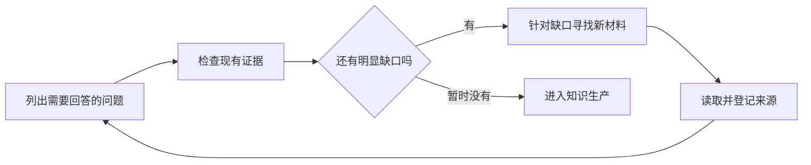
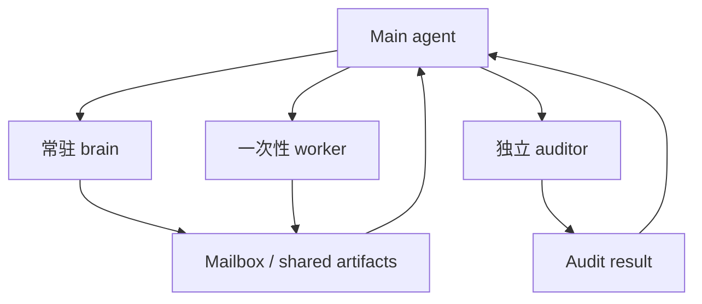
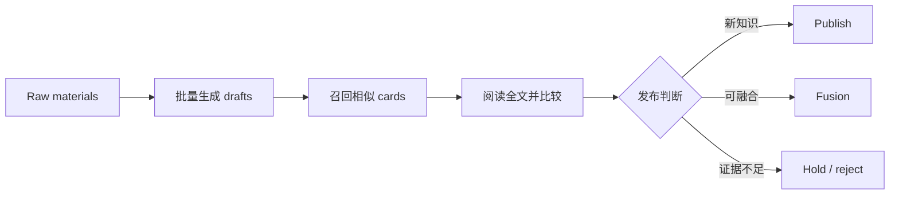
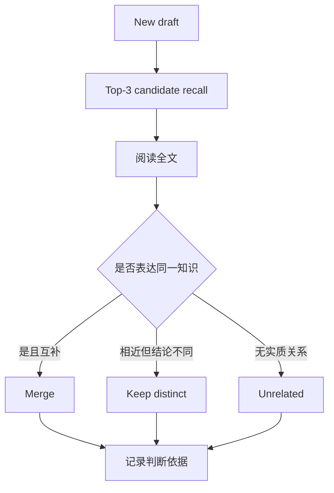
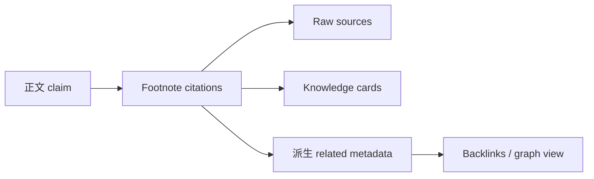
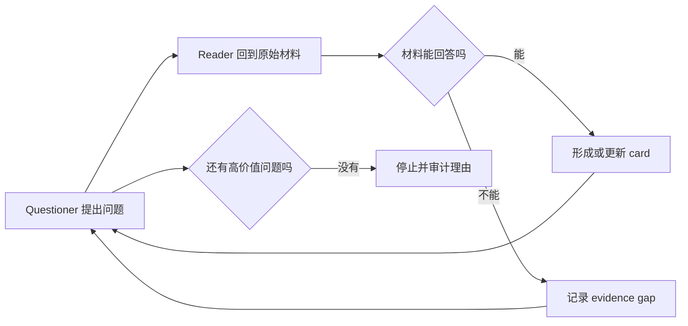
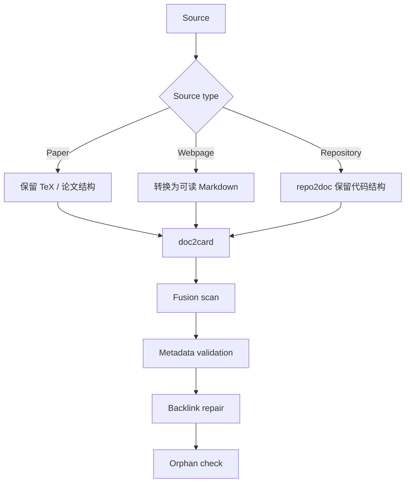

# LLM Wiki Dynamic Issues Demo · Preference-aligned v2

> 本地草稿，未提交 GitHub。`D1-D10` 是发布前占位符。

这次不再给每个 Issue 套完整合同。正文只保留问题刚出现时的状态；后续理解全部按评论追加。

评论也不是 changelog。每条评论要尽量恢复当时的推理现场：看到了什么、为什么觉得不对、有哪些可能解释、为何选择下一步、执行后怎样改变了理解。后来的答案不能把早期的不确定性抹掉。

```text
D1 如何判断原始资料覆盖核心问题
└─ D2 v0 为什么验证机制却产错内容
   └─ D3 知识卡主题应预设还是自主发现
      └─ D4 哪些 sub-agent 应常驻或关闭

D5 v2 为什么 7 小时只产出 15 张卡
├─ D6 v3 如何召回相似卡并保留融合依据
├─ D7 如何避免知识卡没有知识密度
└─ D8 如何统一 citation 与 related metadata

D9 v4 为什么不继承 v3 cards
└─ D10 为什么 repo2doc 必须先于 doc2card
```

---

## D1｜如何判断 LLM Wiki 原始资料已经覆盖核心问题？

**Issue body**

现在先不生产结论。我需要把 Karpathy post、论文、repo、blog 和 discussion 下载到本地，但还不确定“资料足够”应该怎么判断。

`question`

**Comment · 2026-05-21 16:43 · 问题出现**

> 当前阶段的调研，只需要聚焦于【资源获取】……作为一个 raw knowledge database。

- 一开始的判断是：现在还没有资格讨论最终的知识结构，因为手上连“社区到底做过什么”都不清楚。相比立刻让模型写总结，先把博客、论文、repo 和 discussion 原样保存下来更重要。这个阶段的产物不是答案，而是以后可以反复读取的材料底座。

- 这里还有一个隐含问题：下载工具本身不是核心。如果为了采集而安装一套复杂工具，反而会把注意力从“哪些材料值得保留”移到爬虫工程上。所以当时先检查已有能力，只在确实遇到格式或访问障碍时再补工具。

- **Source**: `codex:codex-prehistory-research:H001`

**Comment · 2026-05-21 19:59 · 要求改变**

> 根据第一性原理罗列出来，llm wiki 这个 topic，需要 cover 哪些 facts 和 aspects。

- 采集一段时间后，我意识到“有很多文件”并不能回答“是否足够”。如果没有一个问题清单，agent 很容易围绕最容易找到的材料重复下载，而对缺失的方面没有感觉。

- 因此下一步不是再找更多链接，而是先写出：要理解 LLM Wiki，至少需要知道它的起源、不同实现形式、与 RAG/GraphRAG 的关系、知识生产单元、更新机制、证据边界、社区争议等哪些方面。这个清单不是最终 taxonomy，而是用来暴露材料缺口的临时检查面。

- **Source**: `codex:codex-prehistory-research:H004`

**Comment · 2026-05-21 21:03 · 当前答案**

> plan 的核心逻辑是根据 coverage 不断去寻找信息，直到当前的 data 足够满足 coverage。

- 这里把流程重新想了一遍：不是“先定计划，然后执行完计划”，而是“先列出需要回答的问题，再检查每个问题目前有什么证据，针对空白继续找材料”。新材料又可能暴露新的问题，所以清单本身也要更新。



- 后来落盘的两个文件，本质上只是这个想法的具体化：一个文件列出需要回答的问题和完成条件；另一个文件逐项记录每个问题目前由哪些来源支撑、还缺什么。名字不重要，重要的是 agent 不能再用“下载数量”替代“是否真正回答了问题”。

- 这个机制足以指导下一轮采集，因此先关闭；“问题清单何时算完整”仍然保留为未来可能重开的边界。

- **Evidence**: `loops/v1_topic_hub_skeleton_20260524/reports/coverage_framework.md`

- **Source**: `codex:codex-prehistory-research:H009`

---

## D2｜为什么 v0 验证了知识生产机制，却没有产出真正的 LLM Wiki 内容？

**Issue body**

v0 已经能记录每条知识来自哪里、知识之间怎样引用，以及来源变化后哪些内容需要复查。但它生产出来的东西更像“如何建设知识库”，不是 LLM Wiki 本身。哪里 drift 了？

Parent: D1 · `question`

**Comment · 2026-05-24 · observation**

- 从执行结果看，v0 很成功：来源可以追踪，知识节点可以进入正式视图，一个来源变化后也能找到受影响的内容。所有机械检查都通过了。

- 但重新阅读生成的节点时，出现了明显的不对劲：内容大部分在解释“怎样初始化知识库、怎样记录引用、怎样传播变更”。这些都是生产 LLM Wiki 的方法，却不是用户最初想研究的 LLM Wiki 现象本身。

- 这说明问题不在 pipeline 是否运行，而在 loop focus。我们把“需要建设一个可靠的知识生产系统”误读成了“知识库应该讲知识生产系统”。指标只能证明动作完成，无法证明构建对象没有漂移。

- **Evidence**: `loops/v0_meta_kb_initialization_demo_20260524/kb_initialization_demo_report.md`

**Comment · 2026-05-24 · Plan A**

- 最直接的修复方式是先明确几个真正属于 LLM Wiki 的主题，例如定义、架构、知识表示、检索方式、更新流程和评价方法，然后要求每个主题都必须从已下载材料中获得证据。

- 这个方案的价值是快速把注意力拉回正确对象，并让人能看到“现在有哪些主题完全空白”。它的风险也很明显：主题是提前定的，agent 可能只会把材料塞进已有格子，而看不到来源中自然出现的新知识单元。

- **Result**: v1 得到 8 个 topic views 和 185 条 citation edges。

**Comment · 2026-05-24 · 新问题**

- 8 个主题页生成后，topic drift 确实被纠正了，但新的问题出现了：每个页面都在综合多个来源，修改一条局部事实需要重新理解整篇页面；页面内部也很难区分哪些内容是稳定知识、哪些只是组织叙事。

- 也就是说，hub 适合作为阅读入口，却不适合直接充当生产单元。真正需要重新讨论的是：agent 每次从来源中应该“生产什么”。这个问题已经足够独立，因此从这里派生 D3，而不是继续把所有讨论堆在 v0 的复盘里。

- **Derived issue**: D3

---

## D3｜LLM Wiki 的知识卡主题应该预设，还是由 agent 从来源中自主发现？

**Issue body**

我需要确定：没有约定 card topic 吧？card 的生产应该是 agent 从来源里面自主探索。

Parent: D2 · `question`

**Comment · 2026-05-24 18:27 · requirement**

> 我需要确定是，没有约定 card topic 或者是别的内容吧？card 的生产完全是 agent 的自主探索。

- 这里担心的是换了名字但没有换逻辑：如果先给 agent 一张 topic 列表，再要求每个 topic 生产 cards，本质上仍然是 hub-first。agent 会优先满足预设覆盖，而不是认真回答“这个来源究竟提供了哪些值得独立保存的知识”。

- 所以 card topic 不能成为输入条件。输入应该是来源和证据约束，输出 topic 由 agent 阅读后发现。自主探索不是不受约束，而是不受预设分类约束。

- **Source**: `codex:codex-primary-v0-v2-boundary:H046`

**Comment · 2026-05-24 18:29 · correction**

> loop 的核心是生产知识卡片，而不是聚合知识 hub。这一点有共识吗？

- 这条纠偏进一步明确了层级：card 是生产对象，hub 只是以后可以从 cards 聚合出来的阅读视图。如果把 hub 当生产目标，agent 会为了叙事完整度补写过渡句；如果把 card 当生产目标，agent 首先要保证一个局部知识单元有足够证据、边界清楚、能够独立修改。

- **Source**: `codex:codex-primary-v0-v2-boundary:H047`

**Comment · 2026-05-24 · 当前答案**

- 当前采用的答案是 bottom-up scoped cards：不先规定分类，而是让 card 从 source evidence 中生长。这里的 scoped 不是“越短越好”，而是读者能说清它在回答什么、依赖什么、边界在哪里。

- 为了避免“自主探索”变成随意生成，每张 card 仍然要记录来自哪个来源、引用了什么证据，并经过独立检查后才能进入正式知识库。这个方案解决了生产对象问题，但很快暴露出 agent 协作成本和吞吐问题，因此继续派生 D4、D5。

- **Evidence**: `loops/v2_llm_wiki_loop_20260525/CARD_CONTRACT_V2.md`

- 后续出现两个新问题：agent 协作成本（D4）和 card 吞吐（D5）。

---

## D4｜长程 LLM Wiki loop 中，哪些 sub-agent 应常驻，哪些应及时关闭？

**Issue body**

注意管理 sub-agent 生命周期很重要。但如果每个任务都立刻关闭，可能又要重复 read。哪些 agent 可以 alive 常驻？

Parent: D3 · `question`

**Comment · 2026-05-25 10:10 · requirement**

> 注意管理 sub-agent 的生命周期。这是很重要的一点。

- 此前出现了很多 worker 一直保持 active。主代理并不清楚它们是否仍在工作、是否持有有价值的上下文、是否会继续写同一批文件。最初的反应是加强生命周期管理：任务边界要明确，完成后要回报并关闭，避免无主 agent 长期存在。

- **Source**: `codex:codex-primary-v2-v3-handoff:H002`

**Comment · 2026-05-25 10:14 · 纠偏**

> 是否过度管理了？比如有一些 sub-agent 可以 alive 常驻的。

- 继续讨论后发现，“任务完成就关闭”也可能是局部最优。某些 agent 已经完整读过大量原始材料，如果下一步仍然需要它回答相关问题，关闭后再创建新 agent 会重新支付读取和理解成本。

- 所以真正的问题不是 agent 活多久，而是它是否有稳定职责、后续任务是否复用同一上下文、主代理是否知道它当前状态。之前把生命周期治理理解成 close policy，确实太机械。

- **Source**: `codex:codex-primary-v2-v3-handoff:H003`

**Comment · 2026-05-25 · 当前答案**

- 最后形成的是角色区分：反复处理同一材料域的 brain 可以常驻；只完成一次转换或校验的 worker 应及时关闭；独立 auditor 不应继承执行者的判断。



- 所谓 context isolation，实际意思是每个 agent 只得到完成职责所需的文件和问题，不能默认共享主线程全部上下文。任务说明、交付位置和完成状态通过明确的 task packet 与 mailbox 传递。这样管理的对象是“责任和上下文”，而不是简单管理进程数量。

- **Evidence**: `loops/v2_llm_wiki_loop_20260525/audits/20260525-subagent-lifecycle-session-audit/lifecycle_audit.md`

---

## D5｜为什么 v2 知识卡生产流程运行 7 小时只产出 15 张卡？

**Issue body**

这效率疑似有点太低。是不是 card 生产和即时融合绑得太死了？

Sub-issues: D6, D7, D8 · `question`

**Comment · 2026-05-25 10:23 · bad result**

> 也就是说 7h，你总结出来 15 条 card？这效率疑似有点太低了吧。为什么速度如此之慢。

- 这个数字让我怀疑的不是模型速度，而是流程设计。读取材料、提出 card、立即查重、立即融合、立即审计、再写入正式库全部串在一起，任何一步不确定都会阻塞下一张 card。15 张可能只是流程允许完成的数量，不代表材料只有 15 个知识点。

- **Source**: `codex:codex-primary-v2-v3-handoff:H004`

**Comment · 2026-05-25 10:32 · working hypothesis**

> 先去把所有的 raw material 都跑一遍，生成 draft card 之后，然后再进行融合？

- 工作假设是把“发现知识”和“决定是否发布”拆开。第一遍只要求忠实阅读材料并产出 drafts，不要求当场理解整个知识库；第二遍再把 drafts 与已有 cards 比较。这样既能尽快看见候选知识空间，也能定位成本究竟发生在阅读、比较还是融合。



- 风险是 drafts 可能快速堆积，因此每张草稿仍要记录来源和生成依据，后续审计也不能取消；变化只是从“每生成一张就等待审计”改成“先形成候选集合，再批量收敛”。

- **Source**: `codex:codex-primary-v2-v3-handoff:H005`

**Comment · 2026-05-25 · implemented**

- 执行后，draft-first 证明了吞吐瓶颈确实主要来自过早融合：同一批材料形成了约 171 张 accepted cards。但这个结果不能简单理解为“v3 比 v2 好十倍”；它只说明候选发现与发布决策解耦后，系统不再被逐卡等待拖住。

- 新的成本转移到了后半段：如何找相似卡、怎样判断融合、怎样保证 card 本身有信息量。这些不是本 Issue 的附注，而是从实验结果中长出的独立问题，因此拆成 D6-D8。

- **Evidence**: `loops/v3_llm_wiki_loop_20260525/reports/loop_report.md`

- Close。具体 comparison、card contract 和 citation 分别留在 D6-D8。

---

## D6｜v3 如何轻量召回相似卡片，同时保留可审计的融合判断？

**Issue body**

先不要 implementation。需要一个轻量流程找到最可能重复的 cards，但 similarity 不能直接替代 fusion 判断。

Parent: D5 · `question`

**Comment · 2026-05-25 · question**

> similarity 的 check，这里应该有一个机制。先不要 implementation，先讨论。

- 当 drafts 增长到上百张后，人工逐一和全库比较不可行。但如果直接用 embedding 分数自动合并，又会把“讨论同一对象但结论不同”的 cards 错误吞掉。因此先需要一个只负责缩小候选范围、不会替人做知识判断的机制。

- **Source**: `codex:codex-primary-v2-v3-handoff:H007`

**Comment · 2026-05-25 · 最朴素方案**

> 标题用结巴分词之后，用 jacord……直接给 top 3 做比较呗。

- 这里刻意选择了朴素方案。现阶段需要的是可解释、可快速验证的 baseline，而不是最强语义模型。标题分词后计算词集合重合度，可以廉价返回三张最可能相关的 cards；如果结果不好，也容易看出是分词、标题还是阈值的问题。

- **Source**: `codex:codex-primary-v2-v3-handoff:H008`

**Comment · 2026-05-25 · 之前理解不完整**

- 随后发现之前的理解不完整：Top-3 只是检索结果，不是融合理由。真正的 comparison 必须阅读正文，并回答共同点是什么、差异是什么、为什么选择 merge 或 distinct。否则下一次审计只能看到一个分数，无法恢复当时为何做出决定。



- **Source**: `codex:codex-primary-v2-v3-handoff:H006`

**Comment · 2026-05-26 · result**

- 因此最终把两层职责分开：Jieba/Jaccard 只负责 candidate recall；全文阅读负责 judgment；判断过程写进 comparison provenance。171 份 comparison 生成后，系统可以追溯每张 draft 为什么被保留、融合或拒绝，而不是只看到最终状态。

- **Source**: `claude_code:claude-primary-v3:H006`

---

## D7｜如何避免 LLM Wiki 知识卡过度 atomic，只复述标题而没有知识密度？

**Issue body**

如果 card 只是 title 的 restate 或 paraphrase，没有意义。card 本身应该是知识，但正文又不适合强模板。

Parent: D5 · `question`

**Comment · 2026-05-25 · observation**

> card 太【atomic】了，没有【信息量】。

- 检查实际 cards 后发现，一些内容只是把标题换一种说法，虽然每张卡范围很小，却无法让读者学到任何东西。这里暴露了“atomic”被误解成“字数少、只含一个句子”。形式上容易拆分，不等于知识上可消费。

- **Source**: `codex:codex-primary-v2-v3-handoff:H008`

**Comment · 2026-05-25 · correction**

> card 本身是知识。理解这一点很重要。

- “越短越原子”这个方向错了。card 应该围绕一个清楚问题，保留理解这个问题所需的机制、边界、例子和证据。它可以有内部结构，但不能把关键解释拆散到读者无法独立理解。

- **Source**: `codex:codex-primary-v2-v3-handoff:H009`

**Comment · 2026-05-25 · decision**

- 一开始考虑用模板强制 `what/how/boundary`，但这会把不同知识类型压成同一种文章。最后把机器治理与知识表达分开：metadata 保持稳定，便于检索和审计；正文由知识本身决定结构。时间和 editor entity 用来回答“何时、由谁修改”，tags 只做后续发现，不规定 card 应该写什么。

- **Source**: `codex:codex-primary-v2-v3-handoff:H010`, `H011`, `H012`

- **Evidence**: `loops/v3_llm_wiki_loop_20260525/CARD_CONTRACT_V3.md`

---

## D8｜v3 如何统一 footnotes、card links 与 related metadata，避免多处维护漂移？

**Issue body**

References、Footnotes、card links、related 同时维护，看起来会 drift。能不能只有一个事实源？

Parent: D5 · `question`

**Comment · 2026-05-27 · hypothesis**

- 实际写卡时发现，一句话可能同时由多个 raw sources 支撑，也可能建立在另一张 card 已经解释过的知识上。单个 inline link 无法表达这种多来源支撑；同时手工维护 References、related 和正文链接又容易彼此不一致。

**Comment · 2026-05-27 · decision**

> 最好就是 footnotes 这种形式，因为可以多个。和论文的 citations 一样。

- 选择 footnotes 不是因为格式更漂亮，而是它允许一句话挂多个证据，并把证据放在离 claim 足够近的位置。读者可以从正文追到来源，脚本也能从同一个位置解析关系。

- **Source**: `claude_code:claude-primary-v3:H018`

**Comment · 2026-05-27 · correction**

> related 不应该是【单独维护的】而是应该从【footnotes】里面提出来的。

- 这条纠偏否定了“双重维护”：如果正文已经声明 card A 依赖 card B，就不应该再让模型手写一份 related 列表。两份信息迟早会漂移。related 应是引用事实的派生视图，而不是第二个事实源。

- **Source**: `claude_code:claude-primary-v3:H019`

**Comment · 2026-05-27 · result**

- 最终只维护正文 footnotes，脚本再从其中生成 related metadata 和双链。这样改正文引用后，关系图可以确定性重建。仍未解决的是“只是主题相关但不构成证据”的弱关系，暂时不把它混进 citation。



- 图中的主事实源只有 footnotes。`related metadata` 和 backlinks 都是可重建视图，不应由模型再次独立填写。

- **Evidence**: `loops/v3_llm_wiki_loop_20260525/tools/derive_metadata_from_footnotes.py`

---

## D9｜为什么 v4 不继承 v3 的 171 张 cards，而要从原始材料重新构建？

**Issue body**

v3 已经有 171 张 cards。下一轮为什么不继续扩建，而要让 questioner/reader 从 raw materials 独立重建？

Sub-issue: D10 · `question`

**Comment · 2026-06-02 · important hypothesis**

- 既有 KB 虽然能节省时间，但也会让下一轮沿着已有 cards 提问，难以发现 v3 从未命名的问题。为了区分“机制真的有效”和“只是继承了旧结构”，v4 决定把 v3 KB 从生产起点拿掉，只给原始材料，让 questioner 不断提出尚未回答的问题，再由 reader 回到全文寻找证据。



**Comment · 2026-06-04 · result**

- 初步结果显示，问题驱动确实能让 reader 多次回到同一材料，从不同角度提取知识；约 328 张 active cards 也说明它没有因为缺少旧 KB 而停滞。记录“为什么继续问、为什么停止”的日志，使停止条件比“模型说读完了”更可审计。

**Comment · 2026-06-04 · didn't work**

- 但检查具体产物时，结论不能保持乐观：repo 基本只被当作文本目录，TeX 被转成结构混乱的 TXT，网页也经过了人几乎无法阅读的中间层。更重要的是，cards 生成后没有充分处理重复、链接和融合。

- 这说明 questioner/reader 的推理机制可能 work，但输入给 reader 的 evidence surface 和输出后的治理流程不 work。不能因为 card 数量增加就关闭整个设计问题。

- **Sources**: `claude_code:claude-primary-v4:H015`, `H046`, `H048`, `H052`

- 不能直接 close。派生 D10 处理 source pipeline；后续 v5 ChangeLog 引用本 Issue。

---

## D10｜为什么代码仓库必须先 repo2doc，再进入 doc2card？

**Issue body**

repo 不是普通文本。现在的流程几乎没有真正解析代码仓库；论文、网页和 repo 也不应该走同一种 fallback。

Parent: D9 · `question`

**Comment · 2026-06-04 · correction**

> repo2doc 应该是要先做的。然后才是 doc2card。

- 这里重新确定了顺序。代码仓库的 README、目录、源码、配置和 issue 承担不同语义；如果直接把所有文件拼成文本让模型产卡，模型首先面对的是噪声，而不是 repo 表达的系统结构。需要先把 repo 转成一个仍保留结构、可引用的阅读面，再谈 card extraction。

- **Source**: `claude_code:claude-primary-v4:H046`

**Comment · 2026-06-04 · another bad case**

> webpage to markdown……没必要转 txt 吧。txt……人几乎读不了。

- 网页问题说明这不是 repo 的单点 bug，而是统一 fallback 的设计错误。论文需要保留 TeX 结构，网页适合 Markdown，repo 需要结构化文档。把所有来源都转成 TXT 看似统一接口，实际把最有价值的结构提前丢掉了。

- **Source**: `claude_code:claude-primary-v4:H052`

**Comment · 2026-06-12 · Plan**

- 因此 v5 的工作假设是按 source type 选择读取方式，而不是强制统一格式。读取完成后也不能立刻宣布结束：先检查潜在重复并融合，再验证 metadata 能否解析，然后补齐反向链接，最后找出没有任何连接的孤立 cards。顺序很重要，因为前一步会改变后一步的图结构。



**Comment · 2026-06-12 · result**

- 结果是 63 个有效来源生成 477 张 active cards，orphan 降到 0%。这证明按来源路由和独立图治理能够修复结构完整性。

- 但后验阅读 cards 时又出现新的疑问：结构更完整，不代表每张 card 的解释更充分。一些 cards 的信息密度可能比 v4 低。因此这个 Issue 需要 reopen：当前答案解决了“怎样给 reader 准备材料”和“怎样修图”，没有完全解决“怎样让 reader 真正消化全文”。

- **Evidence**: `loops/v5_llm_wiki_loop_20260612/tools/source_router.py`

- Reopen：router 解决了读取面选择，没有完全解决 extraction quality。

- **Source**: `codex:codex-retro-v4-v5-research:H001`

---

## 发布时的最小规则

1. 按事件时间创建 Issue 和 comments，不先把最终答案写进 body。
2. 父 Issue 保持宽问题；只有评论中长出独立问题时才创建 sub-issue。
3. 评论引用真实用户原话，保留“可能、没用、理解错了”等状态。
4. 最终答案作为最后一条 comment，然后 close；新证据出现时 reopen。
5. 标签只用 `question`、`bad case`、`task`、`changelog` 和少量组件名。
