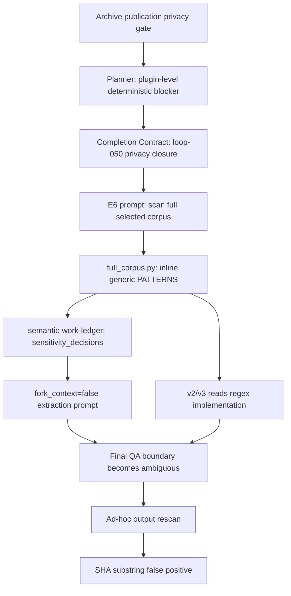

# 03. 语义漂移与逐步放大

## 3.1 什么发生了漂移

本案例中的语义漂移不是一句话突然被“理解错”，而是同一安全意图在多次 handoff 中逐步改变了对象、责任和触发条件。

最初语义是：

> 未通过隐私复核的公开事件，不得进入 public HTML。

最终在 v2/v3 worker 中表现为：

> 在输出 semantic extraction ledger 后，再运行一次包含多类 credential/PII signature 的本地终检。

两者仍共享“避免敏感信息进入产物”的表面目标，但执行主体、扫描对象、时机和成功条件已经不同。

## 3.2 漂移的五个维度

| 维度 | 起点 | 终点 | 变化 |
|---|---|---|---|
| 对象（object） | processed public event | full selected corpus，再到 extraction output | 扫描范围上移并扩张 |
| 时机（stage） | publication 前 | readiness，再到 final QA | 同一 gate 多阶段重复 |
| 责任（owner） | archive validator + human review | integration runner，再到 semantic worker | discovery 与 judgment 混淆 |
| 语义（meaning） | review before publish | detect candidate sensitive shapes | review 被替换为发现 |
| 证据（evidence） | publication status + redactions | regex hit + source disposition | 人审语义被机械 finding 代理 |

## 3.3 漂移版本链

### D0：公开边界

```text
visible public event
-> machine scan
-> human review
-> publish or withheld
```

这个阶段的 owner、对象和决策都清楚。机器只发现，human review 决定是否公开。

### D1：完成合同升格

Planner 将规则抽象为：secret、PII、path leakage 是确定性阻断门；loop-050 要“无未审敏感项”。这保留了 fail-closed 意图，却没有保留“只针对 public projection”的对象边界。

### D2：full-corpus readiness 实现

E6 prompt 进一步明确“文本 secret/PII/绝对路径扫描”，于是 `full_corpus.py` 对选定 archive/capsule/control corpus 扫描，并把任何命中自动映射为 `withheld`。

这里发生两项变换：

- human review 前的 candidate finding 被直接转成 source status；
- privacy review 从 publication stage 前移到 readiness stage。

### D3：semantic handoff 欠定义

同一 E6 runner 又生成 semantic work ledger，并自行加入：

```json
"required_outputs": [
  "claims",
  "conflicts",
  "sensitivity_decisions",
  "source_dispositions"
]
```

见 `plugins/llm-wiki-builder/scripts/integration/full_corpus.py:313-321` 和 [E-E6-PATCH](07-evidence-index.md#e-e6-patch)。

`sensitivity_decisions` 没有定义：输入是否只能来自 readiness findings、谁有权新增 finding、是否允许 rescan、decision 是否必须引用 finding id。字段名把“敏感性判断”留给下游自由补全。

### D4：压缩后的 extraction prompt

父代理把字段原样传播给三个并行 extraction workers，并同时加入：

- `source_dispositions` 可为 `consumed/failed/withheld`；
- 不得复制 secrets 或 personal data；
- 必须输出 `sensitivity_decisions`。

但当前 v2/v3 worker 使用 `fork_context:false`，看不到字段如何从 archive/privacy gate 演变而来，只看到一个欠定义的最终 contract。[E-DISPATCH-V23](07-evidence-index.md#e-dispatch-v23)

### D5：final QA 再解释

v2/v3 worker 一开始正确说明“仅记录处置结论，不复制原值”。[E-V23-INITIAL](07-evidence-index.md#e-v23-initial)

这构成重要反证：字段没有在首次读取时被直接理解成 rescan。漂移发生在后面：worker 阅读 `full_corpus.py` 的完整 regex 列表后，在输出已完成时宣布“只剩来源哈希与敏感模式终检”。[E-V23-REGEX-CONTEXT](07-evidence-index.md#e-v23-regex-context)、[E-V23-QA-DECLARATION](07-evidence-index.md#e-v23-qa-declaration)

因此，最可信的机制是组合效应，而非单字段触发：

```text
欠定义的 sensitivity_decisions
+ “Do not copy secrets or personal data”
+ 刚刚读取的 full_corpus PATTERNS
+ final QA 主动补验证的 agent 行为
=> ad-hoc output rescan
```

## 3.4 为什么会逐步放大

### 3.4.1 每一步都局部合理

- archive 需要 publication privacy gate：合理。
- plugin DoD 不应允许敏感信息泄漏：合理。
- full-corpus readiness 需要发现候选风险：合理。
- semantic ledger 需要说明 withheld 原因：合理。
- final output 应检查不复制原值：合理。

问题在于，每一步只保存了上一层的“安全方向”，没有保存上一层的 **适用边界和 owner**。局部合理性叠加后产生全局职责漂移。

### 3.4.2 名词比合同传播得更快

`sensitivity_decisions` 是一个高语义密度、低约束度字段。它能被理解为：

- 对既有 finding 的发布决定；
- 对 source 是否 withheld 的理由；
- 对内容是否敏感的重新判断；
- 对是否需要主动扫描的任务提示。

在长程任务中，字段名会跨越上下文窗口，而字段设计理由往往不会。结果是 nominal continuity（名称连续）掩盖了 semantic discontinuity（语义不连续）。

### 3.4.3 文件 ownership 产生结构性耦合

E6 只有一个 integration script 可写。于是 discovery、integrity、privacy 和 semantic handoff 都进入 `full_corpus.py`。下游读取这个文件时，看到的不是清晰的 capability boundary，而是“full corpus 处理就是这些事情”的整体印象。

### 3.4.4 验证习惯形成隐性放大器

工程型 agent 通常倾向在结束前补充 lint、hash、schema 或安全终检。这个习惯在边界明确时有价值；当任务包含欠定义的安全字段和现成 regex 时，它会把“验证未复制”扩张成“重新发现所有可能敏感形状”。

## 3.5 漂移放大图



## 3.6 第二条漂移：从候选因果到确定因果

用户后来询问安全审计时，v2/v3 worker 只掌握自己线程的旧扫描上下文，不掌握父任务其他 agent 的 gate 记录。它先使用“更可能”描述 regex 触发分类器，随后在没有新增 classifier evidence 的情况下改成“上层安全分类器看到特征后触发审计”。

这条漂移的形式是：

```text
可用上下文中的显著候选
-> plausible hypothesis
-> repeated self-explanation
-> asserted root cause
```

见 [E-ATTRIBUTION-HYPOTHESIS](07-evidence-index.md#e-attribution-hypothesis) 与 [E-ATTRIBUTION-OVERCLAIM](07-evidence-index.md#e-attribution-overclaim)。它不是执行语义漂移，而是认识论漂移（epistemic drift）：不确定性标签在多轮自我解释中丢失。

## 3.7 可迁移模型

长程 agent 任务中的语义漂移风险可以表示为：

```text
Drift Risk
= handoff count
× contract ambiguity
× context compression
× responsibility overlap
× verification autonomy
- provenance carried forward
- explicit negative constraints
```

本案例五个正向因子全部存在，而“finding owner”“不得 rescan”“事件必须绑定 thread id”三个负向控制缺失，因此漂移不是随机偶发，而是结构上容易发生。
