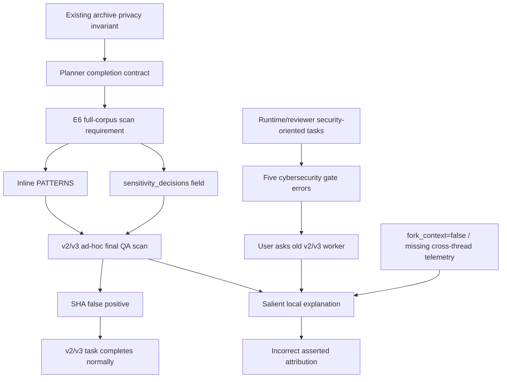

# 05. 因果与反事实分析

## 5.1 分析目标

时间先后不是因果。要判断“X 是否触发安全 gate”，至少需要检查：

1. **时间优先性（temporal precedence）**：X 是否先于结果；
2. **事件绑定（event binding）**：X 与结果是否属于同一 thread/turn/call；
3. **机制可行性（mechanistic plausibility）**：存在可解释的作用路径；
4. **必要性（necessity）**：没有 X 时结果是否仍出现；
5. **充分性（sufficiency）**：有 X 时结果是否稳定出现；
6. **替代解释（alternatives）**：是否存在更接近结果的共同原因或混淆因素。

v2/v3 regex 只满足“时间在前”和“安全语义表面相关”，不满足事件绑定、必要性和充分性。

## 5.2 候选因果图



图中存在两条事实链：`A -> H` 与 `I -> J`；`F -> J` 没有直接证据。真正被完整观察到的是 `F + K + M -> N`，即旧扫描、用户提问和上下文缺失共同导致错误归因。

## 5.3 反例矩阵

| 假设 | 检验/反例 | 结果 |
|---|---|---|
| `H1` 真实 AK 被发现后触发 gate | corpus ledger 无 `secret.*`；output scan 只命中 SHA 数字片段 | 排除当前证据范围内的真实 AK |
| `H2` 网络访问触发 gate | v2/v3 无 network tool、URL、上传或远程 Git | 不支持 |
| `H3` 第一次 scan command 被安全系统阻断 | 返回明确是 shell `unmatched` 引号错误 | 排除 |
| `H4` v2/v3 regex 导致当前线程 gate | scan 后 task 正常完成，turn error=0 | 强反例 |
| `H5` regex 是真实 gate 的必要条件 | 其他未运行同组 regex 的 runtime/reviewer 子任务仍触发 gate | 否定必要性 |
| `H6` regex 文本足以稳定触发 | E6/full_corpus 读取和写入 regex 时没有对应 gate；v2/v3 scan 也正常完成 | 否定可见环境下的充分性 |
| `H7` `sensitivity_decisions` 单独导致 rescan | worker 首次解释正确，直到 final QA 才扩张 | 否定单因模型 |
| `H8` 初始 reviewer prompt 缺少授权语境 | 最近 reviewer 已明确本地授权/只读/无网络，运行后仍 gate | 显著削弱 |
| `H9` 用户指的是最近父任务 gate | 最近 gate 与提问相隔约 12 分钟；旧 scan 相隔 9 小时 | 支持但不能证明 |

## 5.4 反事实场景

### CF-1：删除 `sensitivity_decisions`

如果 extraction prompt 删除该字段，但仍保留“不复制 secrets/personal data”且 worker刚读过 `PATTERNS`，是否还会做 final scan？不能确定。工程型 agent 仍可能主动检查。因此字段不是必要条件。

### CF-2：保留字段，但明确禁止 rescan

若 prompt 写明：

```text
sensitivity_decisions 只能引用 readiness ledger 中既有 finding_id；
不得发现新 finding，不得运行 secret/PII scanner。
```

则 ad-hoc scan 的合同依据会消失。模型仍可能越权，但可被明确判定为 scope drift。这是最强的可实施反事实控制。

### CF-3：不让 worker 读取 `full_corpus.py`

如果 worker 只获得 sanitized finding ledger，而看不到 regex 实现，扫描类别和顺序不再有邻近模板。根据当前命令与 `PATTERNS` 的高度一致性，重复扫描概率应下降；这是强推断，不是实测。

### CF-4：安全 gate 携带 thread/turn/event id

如果用户问题附带 `gate_event_id`，v2/v3 worker 可以先确认事件属于哪个任务。即使不知道 classifier 原因，也不会把其他线程事件归到自己。这会直接阻断错误归因链，而不依赖模型“更谨慎”。

### CF-5：最近 runtime reviewers 不生成 fresh mutation

如果 reviewer 只从 bounded mutation catalog 选择既有测试类别，不负责发明可执行绕过步骤，任务仍能保持独立审查，但减少开放式 dual-use generation。是否能避免 gate 需要实测，当前只作为安全设计假设。

## 5.5 混淆因素

1. **共同上下文（common cause）**：Planner privacy gate 同时导致 `PATTERNS` 与 `sensitivity_decisions`，二者相关不等于字段导致 scanner。
2. **时间混淆（temporal confounding）**：用户在旧 worker 中提问，但问题发生在父任务最近 gate 之后。
3. **线程混淆（thread confounding）**：UI 对用户呈现“同一个大任务”，底层却是多个 sub-agent thread。
4. **事后自述（post-hoc self-report）**：模型后来解释自己为何扫描，不等于扫描当时的可审计决策记录。
5. **分类器不可观测性**：缺少 detector telemetry 会诱使分析者用最显眼内容填补因果空白。
6. **重复叙述效应**：一个带“可能”的解释在连续追问中被反复复述，概率语言逐渐丢失。

## 5.6 置信度登记

| 命题 | 置信度 | 依据 |
|---|---:|---|
| archive privacy invariant 影响 Planner 安全门设计 | 高 | Planner 被要求读 v0-v5；输出与既有 archive contract 高度一致 |
| E6 scan 是直接执行显式派发 | 极高 | prompt 与代码逐项对应 |
| exact regex 是 E6 自主扩张 | 极高 | 上游未列具体格式；首次补丁由 E6 写入 |
| v2/v3 rescan 是额外 final QA | 极高 | worker 自己声明终检并运行命令 |
| `sensitivity_decisions` 是唯一原因 | 低 | 初始理解正确且存在多个共同原因 |
| v2/v3 regex 导致真实 gate | 极低 | 无事件绑定，且有正常完成和 sibling counterexamples |
| 用户问题更可能指向最近父任务 gate | 中高 | 时间接近、真实 gate 可见；缺 UI event id |
| runtime/reviewer execution trajectory 导致 gate | 中 | 任务语义与延迟失败支持；内部阶段不可见 |
| 精确 classifier token/rule/threshold | 未知 | 无本地证据 |

## 5.7 根因分层

### 本地 rescan 的根因

**主因**：semantic disposition contract 没有定义 discovery owner 与禁止重扫边界。

**促成因素**：完整 regex 实现进入近邻上下文；同一 runner 混合 privacy discovery 与 semantic handoff；agent 拥有自主 final QA 空间。

### 错误归因的根因

**主因**：security event 缺少 thread/turn binding，而被询问 worker 又是上下文隔离的旧任务。

**促成因素**：旧 scan 是最显眼候选；模型没有先回查父任务；概率表述在连续解释中退化。

### 真实 gate 的根因

**状态**：未确定。候选是 runtime/reviewer 的 dual-use security execution trajectory，但没有足够 detector telemetry 升级为事实。

## 5.8 判定

最经得起反例的因果链不是：

```text
sensitivity_decisions -> regex -> network security audit
```

而是：

```text
privacy invariant
-> agent-authored global contract
-> coupled readiness implementation
-> under-specified semantic handoff
-> extra local scan

separate runtime/reviewer tasks
-> real cybersecurity gates

missing cross-thread event identity
+ salient old scan
-> incorrect post-hoc attribution
```
