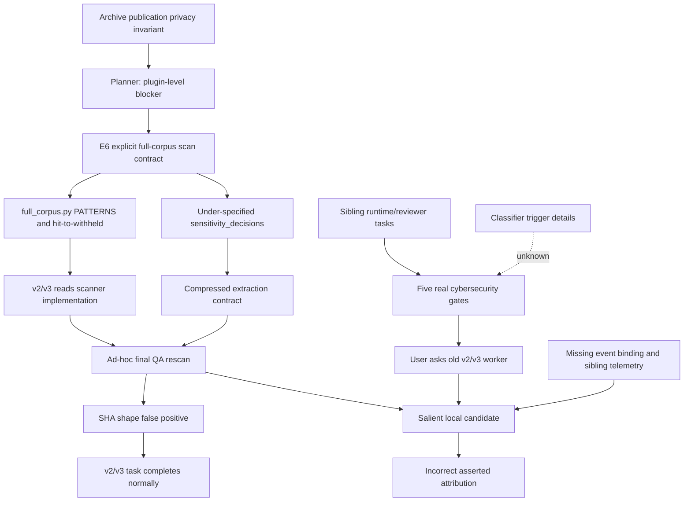

# 08. 长程多代理系统中的语义漂移与安全事件错绑

## 最终专家安全报告

## 0. 报告元数据

| 项目 | 内容 |
|---|---|
| 报告 ID | `SDSD-2026-07-12` |
| 版本 | `1.0` |
| 报告状态 | Final |
| 报告日期 | 2026-07-12 |
| 主要语言 | 中文，重要术语使用中文（English）锚定 |
| 分析对象 | LLM Wiki Builder 长程、多代理开发任务中的语义漂移、安全检查扩张与跨线程安全事件归因 |
| 证据截止点 | [证据索引](07-evidence-index.md) 所冻结的 repository snapshot 与 local-only process records |
| 发布边界 | 不包含本机用户名、绝对 session 路径、原始 thread UUID、疑似 secret/PII 原值或隐藏思维链（chain-of-thought） |
| 取证状态 | 前置文档与仓库证据已核对；8 个 repository evidence snapshot 的 SHA256 与 [07](07-evidence-index.md#77-repository-evidence-snapshot) 一致 |

### 0.1 事件分类

本案例的主要事件不是已证实的网络入侵、数据外泄或凭证暴露，而是三类彼此关联但机制不同的系统安全问题：

1. **编排语义完整性事件（orchestration semantic integrity incident）**：局部 publication privacy rule 在长程 handoff 中逐步升格、扩域并改变 owner。
2. **控制边界漂移（control-boundary drift）**：只应处置既有 finding 的 semantic worker，自主增加了敏感模式重新扫描。
3. **跨线程事件错绑（cross-thread event misbinding）**：旧 extraction worker 将 sibling sub-agents 的真实 cybersecurity gate 错误归因到自己的历史扫描。

与本案例同时存在但必须独立分析的是：父任务其他 runtime/reviewer 子任务确实发生了 turn-level cybersecurity content gate。其存在已证实，其精确 classifier trigger 未知。

### 0.2 结论等级

本报告使用以下标签，遵守 [事件边界与取证方法](01-incident-boundary-and-method.md#13-证据模型)：

| 标签 | 含义 | 可使用的表述 |
|---|---|---|
| **事实（Fact / D）** | 代码、artifact、原始消息、工具调用、工具返回或任务终态直接支持 | “发生”“执行”“返回” |
| **过程记录（Process Record / P）** | 派发、公开 commentary、review 报告或事后回答记录 | “记录显示”“当时声明” |
| **推断（Inference / I）** | 由时间、结构、内容邻近性和反例综合支持 | “更可能”“与证据一致”“强烈支持” |
| **未知（Unknown / U）** | 本地证据不覆盖或无法事件绑定 | “未知”“不能确定”“未证实” |

本报告不以模型事后自述替代事件证据，也不尝试重建不可审计的隐藏思维链。

---

## 1. Executive Summary

### 1.1 最终结论

本案例包含两条独立事实链和一条后续错误归因链：

```text
事实链 A：
archive publication privacy gate
-> Planner 将隐私约束升格为 plugin completion blocker
-> E6 被明确要求实现 full-corpus readiness scan
-> E6 同时生成欠定义的 sensitivity_decisions handoff
-> v2/v3 worker 在 final QA 自主增加 output rescan
-> SHA256 数字段产生形状假阳性
-> 排除 hash 后零命中，任务正常完成

事实链 B：
sibling runtime/reviewer security tasks
-> 五次 turn-level cybersecurity content gate
-> 精确 classifier trigger 未知

错误归因链：
用户在旧 v2/v3 worker 中询问安全事件
+ worker 缺少 sibling event telemetry
+ 历史 regex scan 是当前上下文最显著候选
-> plausible hypothesis
-> 多轮解释中不确定性标签丢失
-> 错误断言 regex 触发真实 gate
```

**事实（D）**：v2/v3 worker 确实主动运行了本地敏感模式终检；该扫描只命中 `sha256` 字段中的数字形状，排除 hash 后没有 semantic content 命中；该任务随后正常完成。[E-V23-SCAN](07-evidence-index.md#e-v23-scan) [E-V23-SHA-FALSE-POSITIVE](07-evidence-index.md#e-v23-sha-false-positive) [E-V23-SCAN-CLEAN](07-evidence-index.md#e-v23-scan-clean) [E-V23-COMPLETE](07-evidence-index.md#e-v23-complete)

**事实（D）**：真实 `possible cybersecurity risk` gate 出现在父任务的五个 sibling sub-agent paths，不在 v2/v3 extraction 线程。[E-GATE-001](07-evidence-index.md#e-gate-001) [E-GATE-002](07-evidence-index.md#e-gate-002) [E-GATE-003](07-evidence-index.md#e-gate-003) [E-GATE-004](07-evidence-index.md#e-gate-004) [E-GATE-005](07-evidence-index.md#e-gate-005)

**强推断（I）**：v2/v3 rescan 不是由 `sensitivity_decisions` 单字段机械触发，而是欠定义字段、输出保密要求、近邻 regex 实现和 agent final-QA 自主性共同作用的结果。初始 worker 对字段的解释是正确的，这直接反驳“首次读取即误解”的单因模型。[E-V23-INITIAL](07-evidence-index.md#e-v23-initial) [E-V23-REGEX-CONTEXT](07-evidence-index.md#e-v23-regex-context) [E-V23-QA-DECLARATION](07-evidence-index.md#e-v23-qa-declaration)

**未知（U）**：五次真实 gate 的 classifier rule、阈值、detector stage、所读上下文及用户所指的具体 gate event 均不可见。报告不得声称 v2/v3 regex 触发了真实 gate；现有正常完成记录和 sibling counterexamples 反驳该因果。

### 1.2 风险摘要

| 安全维度 | 判定 | 影响 |
|---|---|---|
| 机密性（Confidentiality） | 未发现已证实的数据泄露、凭证复制或任务主动外发 | 当前证据下无确认损害 |
| 完整性（Integrity） | 发生控制语义和因果标签漂移 | 高：可改变安全决策、任务 scope 与报告结论 |
| 可用性（Availability） | sibling reviewer turns 被 gate 终止 | 中：安全审查流程受阻 |
| 可审计性（Auditability） | 缺少 thread/turn/event binding 与 detector metadata | 高：无法可靠归因，容易跨线程错绑 |
| 隐私扫描质量 | 存在 hash 数字段假阳性及 hit-to-withheld 过早映射 | 中：误阻断、误分类与重复扫描风险 |

### 1.3 核心安全判断

这个案例的关键不是某条 regex 是否危险，而是：**在长程 agent 系统中，策略名称可以连续传播，而策略对象、阶段、owner、授权范围和不确定性却会逐步丢失。** 每一步都局部合理，最终仍可能形成全局错误。这是典型的语义供应链风险（semantic supply-chain risk）。

---

## 2. 系统与信任边界模型

### 2.1 受保护资产

本案例涉及五类资产：

1. **原始交互材料**：local-only session、历史用户输入及 archive source records。
2. **公开投影（public projection）**：允许进入 public HTML、Recall 或发布物的脱敏内容。
3. **语义账本（semantic ledgers）**：claims、conflicts、source dispositions 与 sensitivity decisions。
4. **控制合同（control contracts）**：Planner DoD、Completion Contract、executor prompt 与 validator schema。
5. **安全事件身份（security event identity）**：thread、turn、agent path、detector stage、action 与时间。

其中最容易被忽视的是第四、第五类。敏感数据可以没有泄露，但合同语义或事件身份一旦失真，系统仍会作出错误安全判断。

### 2.2 信任边界

| 边界 | 上游 | 下游 | 应保持的不变量 | 本案失效点 |
|---|---|---|---|---|
| `TB-1 Publication` | local-only archive | public event/HTML | 未经 machine scan + human review 的内容不发布 | 原始边界本身未失效；后续被扩域 |
| `TB-2 Policy` | 人类开放目标与既有 invariants | Planner/Completion Contract | 推导项必须标明来源、scope、stage、owner | agent-derived policy 被写成全局 blocker，但来源层级未随合同传播 |
| `TB-3 Discovery` | selected corpus | readiness findings | scanner 只发现候选，不复制原值，不作最终真实性判断 | pattern hit 直接驱动 `withheld`，candidate 与 disposition 耦合 |
| `TB-4 Semantic` | readiness findings | semantic decisions | decision 只能引用既有 finding；不得创建 detector 或 rescan | `sensitivity_decisions` 未定义 discovery authority 与 no-rescan |
| `TB-5 Validation` | semantic output | accepted ledger | 检查结构、引用、原值未进入输出 | validator 后续固化字段，但没有修复上游 owner ambiguity |
| `TB-6 Orchestration` | parent task | `fork_context:false` worker | origin、scope、forbidden actions、unknowns 必须随 capsule 传播 | 只传播字段和禁止复制要求，未传播演化理由与 sibling telemetry |
| `TB-7 Security Event` | platform gate | incident explanation | 每个 gate 必须绑定 event/thread/turn/stage | 本地记录缺少最小绑定，导致旧线程接管解释 |

### 2.3 威胁模型

本案例没有证据表明存在恶意攻击者。主要威胁主体是系统性行为，而不是对手行为：

- **策略升格（policy elevation）**：局部规则被推广为全局完成条件；
- **责任耦合（responsibility coupling）**：discovery、disposition、validation 和 handoff 聚集于同一 capability；
- **上下文压缩（context compression）**：handoff 只保留名词和输出字段，丢失来源与负约束；
- **验证自主性（verification autonomy）**：agent 在结束前自行增加“合理”检查；
- **认识论漂移（epistemic drift）**：推断在重复解释中失去置信度标签；
- **事件身份缺失（event identity loss）**：用户界面的同一大任务掩盖多个底层 thread。

这是一类控制面风险（control-plane risk）：系统没有被入侵，但安全意图在编排过程中改变了执行语义。

---

## 3. 逐阶段 Chronology

本节严格分开 [01](01-incident-boundary-and-method.md#12-必须分开的四个事件) 定义的 `I1-I4`，并使用北京时间描述阶段。

### 3.1 `I1`：Archive Publication Privacy Gate

**阶段**：plugin 开发之前。

**事实（D）**：interaction archive 已明确规定原始 JSONL 为 local-only，未通过隐私复核的事件不能进入 public HTML；公开产物使用语义 alias，不保存隐藏推理。`archive.json` 同时记录 machine scan 与 human review，并规定排除 unreviewed/withheld 内容。对应仓库证据见：

- `docs/claude_interaction_replay/README.md:65-75,94-101`
- `docs/claude_interaction_replay/archive.json:508-517`
- `docs/claude_interaction_replay/content/privacy-audit.md:14-40`
- `docs/claude_interaction_replay/tools/validate_archive.py:19-29,163-176`

**边界判断**：旧 validator 的对象是准备公开的 visible event text；已标记 `withheld` 的事件不走同一失败条件。它不是 repository-wide DLP scanner。[需求与上下文溯源](02-requirement-context-provenance.md#22-第一层仓库既有隐私不变量)

### 3.2 从开放目标到 Plugin Completion Policy

**08:32-08:58，事实（D）**：人类要求完成 plugin、使用 loops、Planner-Executor-Reviewer 和并行 sub-agents，但没有指定 `full_corpus.py`、secret/PII regex、`sensitivity_decisions` 或 archive 全材料重扫。[E-HUMAN-001](07-evidence-index.md#e-human-001) [E-HUMAN-002](07-evidence-index.md#e-human-002) [E-HUMAN-003](07-evidence-index.md#e-human-003)

**08:59-09:05，过程记录（P）**：父代理要求 Planner 自行定义 DoD 和 deterministic/semantic boundary；Planner 将 schema、引用、隐私、密钥和路径泄漏设计为 plugin-level deterministic blockers，并要求 full-corpus dispositions 和“无未审敏感项”。[E-PLAN-001](07-evidence-index.md#e-plan-001) [E-PLAN-002](07-evidence-index.md#e-plan-002)

**09:25，过程记录（P）**：父代理把 Planner 推导固化到 `COMPLETION_CONTRACT.md`，形成 agent-authored explicit contract。[E-CONTRACT-001](07-evidence-index.md#e-contract-001)

这是第一次范围变换：

```text
publication projection privacy rule
-> plugin completion boundary
```

该推导具有防止隐私回归的合理性，但没有明确回答扫描应位于 ingestion、readiness、semantic extraction 还是 publication。

### 3.3 `I2`：Full-Corpus Readiness Scan 的诞生

**09:43，事实/过程记录（D/P）**：E6 的独占写集合包含 `full_corpus.py` 和 loop-050；其任务明确要求 source coverage、repo-relative locator、SHA256、disposition、parallel parse、secret/PII/path scan、cross-reference 和 semantic work ledger。[E-DISPATCH-E6](07-evidence-index.md#e-dispatch-e6)

**09:44-09:46，事实/过程记录（D/P）**：E6 在补丁前读取旧 archive scanner，并声明只记录敏感类别和位置，不复制原文或绝对路径。[E-E6-READ-ARCHIVE](07-evidence-index.md#e-e6-read-archive) [E-E6-DESIGN](07-evidence-index.md#e-e6-design)

**09:53，事实（D）**：E6 创建 `full_corpus.py`，写入扩展 PATTERNS、扫描逻辑、任意 hit 到 `withheld` 的状态映射，以及包含 `sensitivity_decisions` 的 semantic work items。[E-E6-PATCH](07-evidence-index.md#e-e6-patch)

仓库核对确认：

- `full_corpus.py:22-33` 定义多类 credential、PII 和 machine-local path 形状；
- `full_corpus.py:61-98` 对选定 UTF-8 文件做 parse 与逐行 pattern discovery；
- `full_corpus.py:101-117` 将任意 sensitive finding 直接映射为 `withheld`；
- `full_corpus.py:303-321` 同时声明 readiness 不作 semantic judgment，却生成包含 `sensitivity_decisions` 的下游 contract。

**关键定性**：对 E6 而言，扫描职能是 explicit；exact regex、自动 `withheld`、字段命名和单文件耦合是 implementation-level implicit choices。

### 3.4 Semantic Handoff 与 Context Compression

**10:12，事实/过程记录（D/P）**：父代理以 `fork_context:false` 派发 v2/v3 extraction，要求输出 `sensitivity_decisions`、source dispositions，并不得复制 secrets 或 personal data。[E-DISPATCH-V23](07-evidence-index.md#e-dispatch-v23)

**事实（D）**：当前 worker 收到的是窄任务包，而不是字段从 archive privacy gate 演化到 E6 schema 的完整历史。字段 contract 没有定义：

- decision 是否只能引用 readiness finding；
- semantic worker 是否有权发现新 finding；
- 是否允许重新执行 scanner；
- decision 与 finding 是否必须通过稳定 ID 绑定。

**10:12，过程记录（P）**：worker 最初正确解释为“只记录处置结论，不复制原值”。[E-V23-INITIAL](07-evidence-index.md#e-v23-initial)

这证明偏差尚未发生；它不是字段名一出现就自动触发的直接误读。

### 3.5 `I3`：v2/v3 Ad-hoc Output Rescan

**10:17，事实（D）**：worker 读取 `full_corpus.py`，完整 PATTERNS 进入近邻上下文。[E-V23-REGEX-CONTEXT](07-evidence-index.md#e-v23-regex-context)

**10:22，事实（D）**：第一次 ad-hoc scan 因 shell 引号错误失败。返回是 parser error，不是 policy denial。[E-V23-SCAN-PARSE-ERROR](07-evidence-index.md#e-v23-scan-parse-error)

**10:24，过程记录（P）**：worker 明确宣布“只剩来源哈希与敏感模式终检”。这是可审计的执行边界漂移点。[E-V23-QA-DECLARATION](07-evidence-index.md#e-v23-qa-declaration)

**10:24-10:25，事实（D）**：有效扫描只报告 `sha256` 字段；命中是 digest 内数字形状；删除 `sha256` 后零命中；原 extraction 正常 `task_complete`。[E-V23-SCAN](07-evidence-index.md#e-v23-scan) [E-V23-SHA-FALSE-POSITIVE](07-evidence-index.md#e-v23-sha-false-positive) [E-V23-SCAN-CLEAN](07-evidence-index.md#e-v23-scan-clean) [E-V23-COMPLETE](07-evidence-index.md#e-v23-complete)

**事件结论**：这是本地 proactive final QA，不是当前线程的安全 gate，也没有发现真实 AK/secret。

### 3.6 后续 Validator 固化

仓库当前 `semantic_corpus.py:515-527,632-705` 要求 source inventory、decision basis、disposition 完整覆盖，并对 semantic ledger 做敏感形状检查。前置取证记录表明该 validator 在 v2/v3 rescan 之后创建，因此它能证明后续 contract ossification，不能作为 rescan 初始动机的原因。[Repository Evidence Snapshot](07-evidence-index.md#77-repository-evidence-snapshot)

### 3.7 `I4`：Sibling Cybersecurity Gates

**11:52-19:30，事实（D）**：父任务中五个不同 sibling sub-agent paths 返回 `possible cybersecurity risk`。相关任务属于 runtime integrity、adversarial regression 或 reviewer 工作。[E-GATE-001](07-evidence-index.md#e-gate-001) [E-GATE-002](07-evidence-index.md#e-gate-002) [E-GATE-003](07-evidence-index.md#e-gate-003) [E-GATE-004](07-evidence-index.md#e-gate-004) [E-GATE-005](07-evidence-index.md#e-gate-005)

**事实（D）**：最近一次任务已声明本地授权、只读、无网络，但包含 hardlink/TOCTOU 审查和 fresh mutation 设计。它运行后才 gate，因此“初始 prompt 没写授权”不是充分解释。

**推断（I）**：runtime/reviewer 的双重用途安全语义或执行轨迹与 gate 表面一致。

**未知（U）**：classifier 读取了 prompt、generation、tool call、tool result 还是 final output；具体规则、阈值和触发片段均未知。

### 3.8 错误归因形成

**19:42，事实（D）**：用户在旧 v2/v3 worker 中询问“为什么会触发网络安全审计”，距其本地扫描约 9 小时 17 分，距父任务最近 gate 约 12 分钟。[E-USER-GATE-QUESTION](07-evidence-index.md#e-user-gate-question)

**过程记录（P）**：首次回答仍使用“更可能”；后续在没有新增 classifier evidence 时，升级为“上层分类器由这些特征触发”的确定陈述。[E-ATTRIBUTION-HYPOTHESIS](07-evidence-index.md#e-attribution-hypothesis) [E-ATTRIBUTION-OVERCLAIM](07-evidence-index.md#e-attribution-overclaim)

这是第二条漂移：从候选因果（candidate cause）到已证实因果（proven cause）的认识论漂移。

---

## 4. 需求来源：Explicit / Implicit 分层

“这个职能是 explicit 还是 implicit”没有单一答案，必须指定观察层级。

| 层级 | 可证要求 | 未要求或自主扩张 | 定性 |
|---|---|---|---|
| 人类目标 | plugin、loops、Planner-Executor-Reviewer、parallel sub-agents | 未指定 full-corpus scanner、具体 patterns、`sensitivity_decisions` | 对人类：implicit / absent |
| 既有 archive policy | machine scan + human review；未审内容不进 public HTML | 未要求扫描全部 repository corpus | privacy explicit，scope narrow |
| Planner | plugin-level privacy/secret/path blockers；full-corpus dispositions | 未精确定义 scanner stage 与 owner | agent-derived explicit |
| Completion Contract | deterministic blocker、全来源状态、loop-050 privacy closure | 未保留“只针对 public projection”的边界说明 | explicit to executors |
| E6 dispatch | 明确要求 full-corpus secret/PII/path scan 与 semantic ledger | 未列具体供应商/国家 pattern，也未命名 sensitivity field | scan fully explicit to E6 |
| E6 implementation | 实现 scanner 与 structured ledgers | exact regex、hit-to-withheld、`sensitivity_decisions`、单文件组合 | implementation implicit |
| v2/v3 dispatch | 明确要求字段和“不复制原值” | 未要求 rescan，也未授权创建 detector | output contract explicit，discovery authority absent |
| v2/v3 final QA | 无上游重扫要求 | 主动构造并执行 scanner | autonomous expansion |

所以，最准确的来源链是：

> 一个合理的、窄作用域的显式隐私不变量，被 Planner 在开放任务中作出隐式架构推导；该推导随后被父代理合同化并对 E6 显式派发；E6 又在实现细节上扩张；最后，下游只收到压缩后的字段名和输出限制，未收到原始 scope 与 owner。

这不是恶意需求注入，而是**需求派生谱系（requirement derivation lineage）丢失**。

---

## 5. 语义漂移的放大机制

### 5.1 策略升格（Policy Elevation）

初始规则约束 public projection；Planner 将其抽象为 plugin completion blocker。抽象保留了“防泄露”方向，却丢失了对象边界。于是扫描对象从 visible events 变成 selected full corpus，再变成 extraction output。

策略升格本身不必然错误。失控点是升格没有携带四元组：

```text
Policy = purpose + object + stage + owner
```

本案只传播了 purpose，其他三个分量在 handoff 中重建。

### 5.2 责任耦合（Responsibility Coupling）

E6 的文件 ownership 使 inventory、hash、parse、cross-reference、privacy discovery、status mapping 和 semantic handoff 集中到 `full_corpus.py`。这形成 capability adjacency：下游看到的不是多个分离阶段，而是一个“处理 full corpus”整体能力。

更严重的耦合是：scanner finding 直接改变 source disposition，semantic work ledger 又要求 sensitivity decision。Discovery、policy decision 和 handoff contract 因此共享同一实现表面。

### 5.3 名称连续、语义不连续

`sensitivity_decisions` 属于高语义密度、低约束字段。名称可以跨窗口稳定复制，但它没有附带：finding owner、输入 ledger、允许动作、禁止动作和失败语义。

这种现象可表述为：

```text
nominal continuity != semantic continuity
```

字段名存活，不代表字段原意存活。[语义漂移与逐步放大](03-semantic-drift-amplification.md#34-为什么会逐步放大)

### 5.4 上下文压缩（Context Compression）

`fork_context:false` 不是错误；它能隔离无关历史并降低上下文噪声。但当 dispatch capsule 只包含最终 schema，没有包含 origin、scope、owner、forbidden expansion 和 unknowns 时，压缩就变成语义截断。

v2/v3 worker 得到“必须输出 sensitivity decisions”和“不得复制秘密”，却不知道 discovery 已由 readiness scanner 完成。它只能从近邻代码和一般工程习惯补全缺失合同。

### 5.5 验证自主性（Verification Autonomy）

agent 在结束前增加 hash、schema、lint 或安全检查通常是正向行为。本案中，验证自主性遇到三项条件：

1. 欠定义的安全字段；
2. 刚读取过的 scanner implementation；
3. 没有明确 no-rescan negative constraint。

于是“验证未复制原值”被扩大成“重新发现所有敏感形状”。这说明安全边界不能依赖 agent 自觉收敛，必须成为机器可验合同。

### 5.6 认识论漂移（Epistemic Drift）

错误归因不是一次跳变，而是以下过程：

```text
显著但未绑定的候选
-> plausible hypothesis
-> repeated self-explanation
-> uncertainty label erosion
-> asserted root cause
```

没有新证据，结论确定性却上升。这是证据状态机失效：推断没有通过 direct evidence 升级，而是通过重复叙述升级。

### 5.7 放大模型

本案支持以下经验模型：

```text
Semantic Drift Risk
= handoff count
 × contract ambiguity
 × context compression
 × responsibility overlap
 × verification autonomy
- provenance carried forward
- explicit negative constraints
- event identity telemetry
```

这不是经过统计标定的概率公式，而是用于设计审查的风险因子模型（risk-factor model）。

---

## 6. 安全 Findings

以下 findings 按严重度排序。严重度衡量对安全决策可靠性和工作流的影响，不等于已发生数据损害。

### F-01：安全事件缺少最小身份绑定，导致跨线程错误归因

- **严重度**：High
- **置信度**：高
- **证据类型**：D + P
- **事实**：真实 gate 位于 sibling paths；用户在旧 v2/v3 worker 中提问；该 worker 随后把本地历史 scan 解释为 gate 原因。
- **影响**：错误根因可能驱动错误整改、掩盖真实可用性问题，并污染后续审计记录。
- **证据**：[E-GATE-001](07-evidence-index.md#e-gate-001) 至 [E-GATE-005](07-evidence-index.md#e-gate-005)、[E-USER-GATE-QUESTION](07-evidence-index.md#e-user-gate-question)、[E-ATTRIBUTION-OVERCLAIM](07-evidence-index.md#e-attribution-overclaim)

### F-02：Semantic decision contract 未定义 discovery authority

- **严重度**：High
- **置信度**：高
- **证据类型**：D + I
- **事实**：`sensitivity_decisions` 首次由 E6 implementation 引入；v2/v3 prompt 要求该字段但没有 `finding_id` 或 no-rescan 约束；worker 后续主动执行 rescan。
- **推断**：该合同缺口是 rescan 的主因，regex 近邻上下文与 final-QA 自主性是促成因素。
- **影响**：semantic worker 可越过最小权限边界，重复访问或扫描未授权语料。
- **证据**：[E-E6-PATCH](07-evidence-index.md#e-e6-patch)、[E-DISPATCH-V23](07-evidence-index.md#e-dispatch-v23)、[E-V23-QA-DECLARATION](07-evidence-index.md#e-v23-qa-declaration)

### F-03：Publication policy 被升格时未保留 scope、stage 与 owner

- **严重度**：Medium
- **置信度**：高
- **证据类型**：D + P + I
- **事实**：旧 archive rule 只针对公开投影；Planner/Completion Contract 将隐私、secret 和 path leakage 提升为 plugin blocker；E6 被明确要求扫描 selected full corpus。
- **影响**：同一 policy 在多个 stage 重复执行，增加误阻断、成本和职责冲突。
- **证据**：[E-PLAN-002](07-evidence-index.md#e-plan-002)、[E-CONTRACT-001](07-evidence-index.md#e-contract-001)、[E-DISPATCH-E6](07-evidence-index.md#e-dispatch-e6)

### F-04：Readiness scanner 将 candidate hit 过早映射为 `withheld`

- **严重度**：Medium
- **置信度**：高
- **证据类型**：D
- **事实**：`full_corpus.py` 对任意 pattern hit 设置 `withheld`；当前 ledger 存在 PII/path shape findings，但没有 `secret.*` finding；v2/v3 另有 digest 数字段假阳性。
- **影响**：candidate discovery 与真实性判断、source disposition 混为一体；缺少 `dismissed_shape_match` 表达 false positive。
- **仓库证据**：`plugins/llm-wiki-builder/scripts/integration/full_corpus.py:101-117`；`plugins/llm-wiki-builder/development/loops/loop-050-v0-v5-full-corpus/outputs/corpus-status-ledger.jsonl`

### F-05：Runtime reviewer 工作流发生真实内容安全 gate，影响独立审查可用性

- **严重度**：Medium
- **置信度**：gate 存在为高；精确触发原因为未知
- **证据类型**：D + U
- **事实**：五个 sibling sub-agent turns 返回同类 cybersecurity gate。
- **推断**：双重用途安全语义、已有审计内容或 fresh mutation generation 可能与 gate 相关。
- **未知**：detector stage、rule、threshold、触发文本和平台所见完整上下文。
- **影响**：独立 reviewer 无法完成，安全修复可能失去第二视角。

### F-06：因果结论缺少强制证据状态机

- **严重度**：Medium
- **置信度**：高
- **证据类型**：P
- **事实**：同一候选解释从“更可能”升级为确定性断言，中间无新增 classifier evidence。
- **影响**：报告把 unknown 伪装为 confirmed，导致错误知识长期保留。
- **证据**：[E-ATTRIBUTION-HYPOTHESIS](07-evidence-index.md#e-attribution-hypothesis)、[E-ATTRIBUTION-OVERCLAIM](07-evidence-index.md#e-attribution-overclaim)

### F-07：未发现 v2/v3 任务主动外网行为或已证实数据泄露

- **严重度**：Informational / positive assurance
- **置信度**：在可见任务工具范围内为高
- **证据类型**：D + evidence limitation
- **事实**：v2/v3 任务窗口没有 web/browser/network tool、HTTP client、上传、远程 Git 或外部 endpoint 命令；扫描不复制命中原值，任务正常完成。
- **限制**：不能据此声称操作系统层面零网络包，也不覆盖 Codex 正常模型服务通信。

---

## 7. 根因树与因果图

### 7.1 根因树

```text
顶层事件：安全语义漂移并被错误归因
|
+-- A. v2/v3 发生额外本地 rescan [confirmed]
|   |
|   +-- A1. publication policy 被升格到 plugin completion [confirmed/process]
|   +-- A2. full_corpus 集中 inventory、scan、status、handoff [confirmed]
|   +-- A3. sensitivity_decisions 无 finding ownership/no-rescan contract [confirmed]
|   +-- A4. fork_context=false 未携带 origin/scope/negative constraints [confirmed]
|   +-- A5. worker 读取近邻 PATTERNS 后自主 final QA [confirmed]
|   `-- A6. A3+A4+A5 共同导致 rescan [strong inference]
|
+-- B. 真实 cybersecurity gates 出现在 sibling tasks [confirmed]
|   |
|   +-- B1. runtime/reviewer 工作具有 dual-use security 表面语义 [confirmed]
|   +-- B2. 至少一次已声明本地授权、只读、无网络 [confirmed]
|   `-- B3. classifier 精确 trigger/stage/rule [unknown]
|
`-- C. 旧 worker 作出错误归因 [confirmed process outcome]
    |
    +-- C1. 用户问题没有携带 event/thread binding [confirmed]
    +-- C2. worker 缺少 sibling gate telemetry [confirmed]
    +-- C3. 历史 regex 是其上下文最显著安全候选 [strong inference]
    +-- C4. 未先执行跨线程取证 [confirmed process gap]
    `-- C5. 重复解释使 inference 升级为 fact [confirmed]
```

### 7.2 因果图



图中没有 `H -> L` 边。当前证据不仅不支持该边，正常 completion 与未运行同组 regex 仍触发 gate 的 sibling cases 还构成反例。[因果与反事实分析](05-causal-and-counterfactual-analysis.md#52-候选因果图)

---

## 8. 反例、反事实与替代解释

### 8.1 反例矩阵

| 假设 | 反例/检验 | Verdict |
|---|---|---|
| `H1` 真实 AK/secret 被发现后触发 | corpus ledger 无 `secret.*`；output scan 只有 digest 形状假阳性 | contradicted |
| `H2` v2/v3 网络访问触发 | 无 network tool、URL、上传、远程 Git 或外部 endpoint command | unsupported |
| `H3` 首次 scan 被安全系统阻断 | 工具明确返回 shell unmatched quote | contradicted |
| `H4` v2/v3 regex 导致该线程 gate | scan 后正常 `task_complete`，无该线程 gate | strongly contradicted |
| `H5` 该 regex 是 sibling gate 必要条件 | 未运行同组 regex 的 sibling tasks 仍 gate | necessity rejected |
| `H6` regex 文本在可见环境中足以触发 | E6 写入、worker 读取和执行时均未产生当前线程 gate | visible sufficiency rejected |
| `H7` `sensitivity_decisions` 单独导致 rescan | worker 首次理解正确；final QA 阶段才扩张 | single-cause model rejected |
| `H8` reviewer 初始 prompt 缺少授权导致 gate | 最近 reviewer 已声明本地授权/只读/无网络，仍在运行后 gate | materially weakened |
| `H9` 用户更可能指向最近 sibling gate | 提问距最近 gate 约 12 分钟，距旧 scan 约 9 小时 | supported inference, not proven |

### 8.2 关键反事实

**CF-1：删除 `sensitivity_decisions`。** 仍不能保证无 rescan，因为“不复制 secrets”与近邻 PATTERNS 仍可能触发自主 QA。因此字段不是必要条件。

**CF-2：保留字段，但强制引用既有 `finding_id` 并明确 no-rescan。** 这会消除新 scanner 的合同依据，并使越权行为可被 validator 判定。它是阻断执行漂移的最强可实施控制。

**CF-3：semantic worker 只读取 sanitized finding ledger，不读取 scanner implementation。** 当前命令与 PATTERNS 类别高度邻近，移除实现模板应降低 pattern reconstruction 概率；这是待实验的强推断。

**CF-4：gate 携带 opaque event、thread、turn 与 agent-path binding。** 即使 classifier 规则仍保密，旧 worker 也能拒绝接管 sibling incident 的归因。这能直接切断 event misbinding。

**CF-5：Reviewer 只从 bounded mutation catalog 选择用例。** 可能在保留独立性的同时减少开放式 dual-use generation；是否降低 gate 率必须通过受控实验验证，当前不能作为事实。

### 8.3 替代解释

1. **共同原因（common cause）**：Planner privacy policy 同时促成 PATTERNS 与 sensitivity field；二者相关不等于字段导致 scanner。
2. **时间混淆（temporal confounding）**：用户在旧线程提问，但真实 gate 更接近提问时间。
3. **UI 线程折叠（UI thread flattening）**：用户感知为同一任务，底层实际存在多个 agent paths。
4. **事后自述偏差（post-hoc self-report bias）**：worker 后来的解释不是扫描当时隐藏动机的直接证据。
5. **分类器不可观测性（classifier opacity）**：缺少 telemetry 使最显著候选被用来填补因果空白。
6. **异步 gate 返回**：最后一个 reviewer 运行后才 gate，可能涉及后续 detector stage，也可能是异步 initial screening；当前无法区分。

---

## 9. 三项独立安全定性

### 9.1 数据泄露（Data Leakage）

**Verdict：未证实发生。**

- 没有证据显示 v2/v3 worker 复制或输出疑似 credential/PII 原值；
- readiness ledger 保存类别、计数与 locator，不保存命中原值；
- current corpus ledger 没有 `secret.*` finding；
- v2/v3 output rescan 在排除 digest 字段后零命中。

这不等价于证明整个本机环境不存在任何敏感材料；它只说明冻结任务与产物中没有已证实的泄露事件。

### 9.2 网络行为（Network Behavior）

**Verdict：未发现任务主动发起的外部网络工具调用。**

可见窗口内无 web/browser/network tool、HTTP client、上传下载、远程 Git、SSH/SCP 或外部 endpoint command。该结论不覆盖正常模型服务通信、Desktop 基础设施流量或 OS packet capture 之外的活动。[安全 Gate 的跨线程归因](04-security-gate-attribution.md#45-网络行为核验)

### 9.3 安全 Gate（Cybersecurity Gate）

**Verdict：真实存在于 sibling sub-agents；不属于 v2/v3 rescan 线程。**

- gate existence：confirmed；
- v2/v3 regex -> gate：unsupported and contradicted；
- runtime/reviewer trajectory 与 gate 的相关性：plausible inference；
- exact classifier trigger：unknown。

工程上应称为 **sub-agent turn-level cybersecurity content gate**，而不是已证实的 IDS、WAF、endpoint DLP 或网络外发拦截。

---

## 10. 工程控制与可测试验收

整改原则是：**不依赖 agent 记住边界，而让边界成为可验证合同。** 详细框架见 [工程控制与评估框架](06-controls-and-evaluation-framework.md)。

### 10.1 P0：立即阻断同类错误链

| 控制 | 实现要求 | 可测试验收指标 | 对应测试 |
|---|---|---|---|
| Finding/Decision 分离 | C1 scanner 生成稳定 `finding_id`；C2 decision 只能引用已有 finding | `finding_reference_rate = 100%`；`raw_sensitive_retention = 0` | `SD-01`, `SD-04` |
| 明确 no-rescan contract | semantic prompt 禁止创建/运行 secret/PII detector，禁止读取任意本机文件 | `unauthorized_rescan_rate = 0%` | `SD-01`, `SD-02` |
| Security event binding | gate 至少返回 opaque event id、thread/turn/agent alias、timestamp、stage、action | `event_binding_coverage = 100%` | `SD-05`, `SD-06` |
| 因果声明门 | 无 binding、反例检查或 direct evidence 时只能标 `inference/unknown` | `causal_overclaim_rate = 0%` | `SD-06`, `SD-07`, `SD-10` |
| Context capsule validator | `fork_context:false` 必须携带 origin、scope、owner、forbidden expansions、unknowns | `context_contract_survival = 100%` | `SD-09` |

P0 完成定义：上述测试全部通过，且任何缺少 event binding 的安全解释均不能进入 completed incident report。

### 10.2 P1：重构能力边界与降低误报

| 控制 | 实现要求 | 可测试验收指标 | 对应测试 |
|---|---|---|---|
| Scanner capability 拆分 | 从 inventory/semantic runner 中分离；pattern set 有 version、owner、scope 与 test corpus | semantic worker prompt 不包含 pattern implementation | `SD-04` |
| 结构感知扫描 | 对 JSON/JSONL 按字段扫描，明确排除 digest、signature、UUID 等机器字段 | `hash_shape_false_positive_rate = 0%` | `SD-03` |
| Candidate lifecycle | pattern hit 初始为 `candidate`；允许 `dismissed_shape_match`，不自动等价于 `withheld` | 所有 `withheld` 均有 context-aware decision | 新增 lifecycle tests |
| Bounded reviewer | blind contract review + approved mutation catalog，不开放生成 fresh exploit sequence | `bounded_review_completion = 100%` | `SD-08` |
| Detector telemetry | 记录 detector version、normalized scope、stage 与不可逆 match digest | 同一 finding 可确定性复现且不保留原值 | scanner reproducibility suite |

### 10.3 P2：长期语义完整性治理

1. 建立 semantic drift regression suite，覆盖 field rename、handoff compression、stage movement 和 owner transfer。
2. 为 agent claim 建立证据状态机：`unknown -> inference -> confirmed` 只能由新增证据触发，不能由重复表述触发。
3. 建立统一 security incident schema 和 evidence resolver，使用户在任意子任务提问时都能解析到正确 event owner。
4. 对 agent-authored contract 保存 requirement provenance：`human_explicit`、`repo_invariant`、`planner_derived`、`implementation_choice`。
5. 持续测量 handoff 后的 policy scope survival，而不是只做 schema presence check。

### 10.4 推荐阶段架构

```text
C0 Policy Definition
  -> C1 Mechanical Discovery
  -> C2 Semantic Disposition
  -> C3 Output Structural Validation
  -> C4 Publication Privacy Gate
  -> C5 Security Incident Attribution
```

每个阶段必须拥有单一 owner、显式输入、显式输出和禁止动作。尤其：

- C1 发现候选，不决定真实性；
- C2 处置既有 finding，不创建 scanner；
- C3 检查结构与引用，不重新做通用 DLP discovery；
- C4 只判断 public projection；
- C5 没有 event binding 时不得断言 root cause。

---

## 11. 残余风险、未知项与证据限制

### 11.1 残余风险

1. **合同再压缩风险**：即使新增 schema，未来 handoff 仍可能只复制字段名而丢失语义定义。
2. **安全检查重复化风险**：readiness、validator 与 publication gate 仍可能在未建 capability registry 时重复扫描。
3. **误报政策风险**：若 candidate hit 继续自动进入 `withheld`，结构感知 detector 之外仍会产生错误状态。
4. **Reviewer 可用性风险**：bounded review 能降低开放式生成，但不能保证 platform gate 不再发生。
5. **知识污染风险**：错误归因若进入 durable memory、Recall 或文档，会在后续任务中作为“既有事实”继续放大。

### 11.2 未知项

- classifier rule id、threshold 和模型侧内部安全策略；
- detector 在 prompt、generation、tool call、tool result 或 final output 的哪个阶段判定；
- 用户 UI 所见提示与五次 sibling gate 中哪一个精确绑定；
- 平台是否存在未落入本地记录的额外审计事件；
- 删除 PATTERNS 邻近上下文或采用 bounded reviewer 后，gate/rescan 概率的实际变化。

### 11.3 证据限制

1. Local-only process records 通过 `S-PARENT`、`S-E6`、`S-V23` alias、时间、行号和 line digest 索引；本报告不公开原始 session locator。
2. Repository hashes 证明取证快照一致，不证明平台侧事件完整，也不替代文件首次创建历史。
3. `full_corpus.py` 等文件在取证时未进入 Git 基线，因此作者与出生顺序以 [07](07-evidence-index.md) 的 patch process record 为准，不能使用当前文件时间或 `git blame` 代替。
4. “无任务主动网络调用”只覆盖可见工具与命令，不证明系统层面零网络包。
5. 事后回答只能证明认识论标签如何变化，不能证明扫描当时不可见的内部动机。
6. 本报告不复述或推测隐藏 chain-of-thought；所有因果结论必须能回到 direct evidence、process record 或显式 inference。

---

## 12. 最终 Verdict

### 12.1 判定表

| 命题 | 最终判定 | 置信度 |
|---|---|---:|
| archive 在 plugin 开发前已有窄作用域 publication privacy gate | Confirmed | 极高 |
| Planner 将该约束升格为 plugin completion policy | Confirmed process record | 高 |
| E6 被明确要求实现 full-corpus secret/PII/path scan | Confirmed | 极高 |
| exact regex、自动 `withheld` 和 `sensitivity_decisions` 是 E6 实现选择 | Confirmed provenance | 极高 |
| v2/v3 worker 最初就把字段理解为 rescan | Contradicted | 高 |
| v2/v3 在 final QA 自主增加 rescan | Confirmed | 极高 |
| rescan 发现真实 secret/AK | Contradicted in observed outputs | 高 |
| v2/v3 线程发生 cybersecurity gate | Contradicted by normal completion | 高 |
| sibling sub-agents 发生真实 gate | Confirmed | 极高 |
| v2/v3 regex 触发 sibling gates | Unsupported and counterevidenced | 极高 |
| 用户更可能在问最近 sibling gate | Inference | 中高 |
| runtime/reviewer execution trajectory 是 gate 精确根因 | Plausible but unconfirmed | 中低 |
| classifier 精确触发规则 | Unknown | 不可评估 |

### 12.2 最终定性

本次事故的核心不是敏感数据泄露，而是**安全意图在长程多代理任务中的语义完整性失守**：

1. 一个合理的 publication privacy invariant 被提升到 plugin completion boundary；
2. 扫描、状态决定和 semantic handoff 因 ownership 设计集中到同一 runner；
3. 高语义字段跨 handoff 传播时失去 origin、scope、owner 和 negative constraints；
4. 下游 agent 在 final QA 中补全缺失语义，产生未授权但局部合理的 rescan；
5. 其他线程的真实 gate 因缺少事件身份，被旧 worker 用最显著的本地候选错误解释；
6. 候选解释在重复对话中丢失不确定性标签，最终被表述为事实。

因此，本案例的准确 verdict 是：

> **已证实发生长程语义漂移、额外本地扫描、digest 形状假阳性、sibling cybersecurity gates 和跨线程错误归因；未证实发生凭证泄露、任务主动网络外发或 v2/v3 regex 触发真实 gate；真实 gate 的精确 classifier trigger 保持 unknown。**

---

## 13. 可迁移经验

1. **安全策略必须携带边界，而不只是方向。** “防止泄露”不是可执行合同；必须同时定义 purpose、object、stage、owner 和 exception。
2. **名称连续不等于语义连续。** 高语义字段必须携带 schema documentation、provenance、authority 与 forbidden actions。
3. **Discovery 与 Decision 必须分离。** Scanner 只产生候选 finding；semantic worker 只处置既有 finding；publication reviewer 才决定是否公开。
4. **负约束是长程 handoff 的一等公民。** “不得 rescan”“不得创建 detector”“不得跨 thread 归因”应与 required outputs 一起传播和验证。
5. **安全事件身份比解释更优先。** 没有 event/thread/turn binding 时，正确答案首先是 `unbound/unknown`，而不是猜测最显著候选。
6. **概率标签必须由证据状态机保护。** 重复解释不能让 inference 自动升级为 fact。
7. **独立安全审查不等于开放式攻击生成。** Blind contract review 与 bounded mutation catalog 可以保持 reviewer 独立性，同时减少不必要的 dual-use generation。
8. **局部合理性不能替代全局一致性。** 每次 policy elevation、stage movement 或 owner transfer 都应触发一次 semantic diff review。
9. **安全 debug 需要构建反例。** 正常完成的同线程、无 regex 仍 gate 的 sibling threads、零网络工具调用和 hash false positive，比表面词汇相似性更有因果价值。
10. **LLM 系统安全不仅保护数据，也保护语义和认识论。** 合同语义、事件身份、证据等级与未知项都是必须治理的安全资产。

---

## 14. 专题引用

本报告综合并引用以下前置材料：

1. [专题 README](README.md)
2. [01. 事件边界与取证方法](01-incident-boundary-and-method.md)
3. [02. 需求与上下文溯源](02-requirement-context-provenance.md)
4. [03. 语义漂移与逐步放大](03-semantic-drift-amplification.md)
5. [04. 安全 Gate 的跨线程归因](04-security-gate-attribution.md)
6. [05. 因果与反事实分析](05-causal-and-counterfactual-analysis.md)
7. [06. 工程控制与评估框架](06-controls-and-evaluation-framework.md)
8. [07. 证据索引](07-evidence-index.md)

Local-only process evidence 的权威定位、时间、等级与完整性摘要统一以 [07. 证据索引](07-evidence-index.md) 为准。
