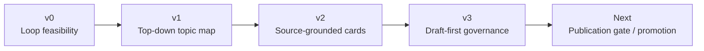
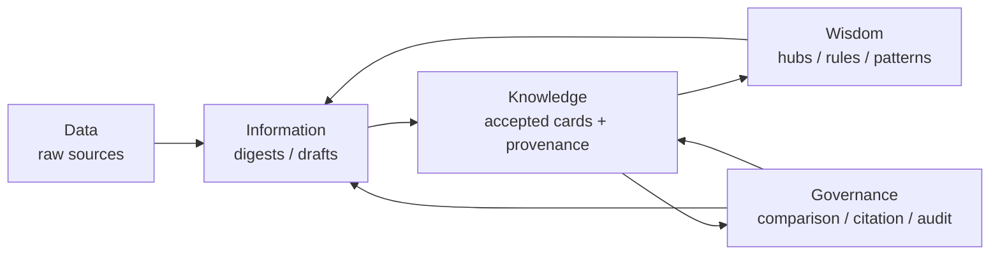
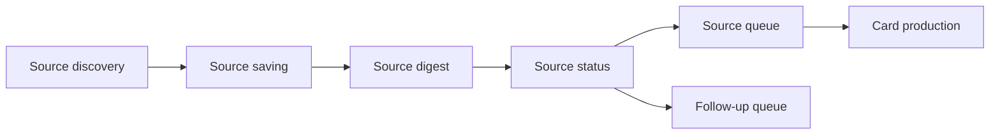
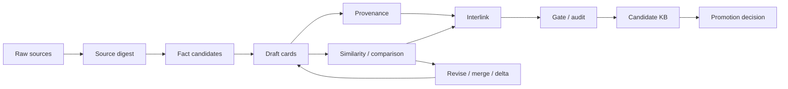

# LLM Wiki 探索实验分享

本文是一份面向内部同事的实践复盘，用一个实际 repo case 说明：当一个领域已经有大量论文、博客、repo、讨论串和网页材料，却尚未形成成熟知识库时，如何让【智能体循环（agent loop）】把【原始来源（raw sources）】持续编译成可读、可追溯、可审核、可修订、可生长的【LLM Wiki】。

这份材料的重点是实践 idea、演变过程、阶段性结果和下一步问题。它不会展开 hooks、CLI、worker、schema 等实现细节，读者无需打开本地 repo。

## 一页结论

本实验的核心判断可以先放在开头：

**LLM Wiki 的价值重点是建立一套从原始文档到候选知识库、再到稳定知识产品的【知识治理（knowledge governance）】流程。**

这里的 scope 需要先和 Karpathy gist 中的设想区分开：

| 场景 | 起点 | 主要问题 | 人和 agent 的关系 |
| --- | --- | --- | --- |
| 个人 wiki / 已有知识库 | 已经有相对友好的个人偏好、笔记、wiki 或知识数据库 | 如何让 LLM 更好地读写、维护、查询已有知识 | 人已经拥有主要知识结构，LLM 负责增强消费和维护 |
| 本实验的 LLM Wiki | 只有原始文档、数据、讨论和实现材料 | 如何从材料中构建人和 agent 都能消费、并由 agent 持续维护的知识生态 | Agent 负责迭代、升级、维护和基于使用历史更新；人负责检查、消费、审核和关键发布决策 |

因此，本实验的关注点从“查询已有 wiki”转向更现实的企业 / 研究场景：**材料先于知识库存在，知识库需要从材料中被构建出来。**

整体迭代逻辑如下：



| 阶段 | 关键判断 | 阶段结果 |
| --- | --- | --- |
| v0 | 先验证 loop 能跑通 | 机制可运行，但内容偏向 meta knowledge |
| v1 | 尝试用主题骨架规划知识库 | 形成注意力地图，但 topic 过早压过证据 |
| v2 | 转向从来源中生成 scoped cards | 小规模 accepted card 链路成立 |
| v3 | 采用【草稿优先（draft-first）】生产，再通过治理吸收 | 形成 `candidate_ready` 的候选知识库 |

v3 的最新阶段性结果可以压缩为四个数字：

| 类别 | 数值 | 含义 |
| --- | ---: | --- |
| **Sources** | **72** | 处理 72 条来源队列 |
| **Cards** | **171** | 形成 171 张 candidate / accepted cards |
| **Governance** | **342** | 171 份【来源证据（provenance）】+ 171 份【比较证据（comparison provenance）】 |
| **Links** | **974** | 建立 974 条 related / interlink 边 |

这些数字代表生产系统已经跑出规模，形成了可检查、可导航、可继续提升的【候选知识库（candidate KB）】。它目前仍处于候选层；root 级【稳定发布物（stable product）】需要额外的人工【提升决策（promotion decision）】。

---

## Part 1. Intro / Framework

### 1.1 LLM Wiki 是一类什么问题

Karpathy 提出的 LLM Wiki，可以理解为一种新的知识工作范式：**让 LLM 在【原始来源（raw sources）】和【用户查询（query）】之间，持续维护一个可复利、可链接、可审计、可被人和 agent 共同消费的知识层。**

普通【检索增强生成（RAG）】通常在用户提问时检索相关片段，再生成一次性回答。它解决的是“回答时能否找到材料”的问题。LLM Wiki 进一步追问：这些材料能否沉淀为长期可复用、可更新、可治理的知识对象？

它的基本心智模型可以写成：

```text
raw sources
  -> LLM-maintained wiki
  -> query / exploration
  -> valuable answers write back to wiki
```

核心类比是：**Obsidian 是 IDE，LLM 是 programmer，wiki 是 codebase。** 这句话强调的是长期维护：新资料进入旧结构，旧说法被更新，冲突被记录，链接保持可导航，有价值的问答结果写回知识库。

本文采用的工作定义是：

> **LLM Wiki 是一个由 LLM / agent 持续维护的【知识卡片系统（knowledge card system）】。每个【知识卡片（knowledge card）】是人类可读、agent 可操作、来源可追溯的知识对象；卡片之间通过链接、引用、标签、实体关系、主题关系和时间关系形成轻量知识图；系统通过持续的提取、定界、去重、融合、链接、审核和提升，把原始文档逐步转化为可复用的知识库。**

这个定义有三个重点：

**第一，知识卡片是知识库中的默认最小单元。** 这是一条【建模原则（modeling principle）】，不是强制切分规则。每张 card 应该是一个可以被人或 agent 直接完整消费的【信息簇（consumable information cluster）】。长文档适合保存原始语境，但过长、过粗，难以局部更新，也难以被 agent 稳定复用。LLM Wiki 需要把文档中的知识拆解、重组和提升为更小、更清晰、更可操作的卡片。后续如果某张 card 需要继续拆细，原 card 可以自然转化为 hub、上层 card 或导航 card。

**第二，图结构是组织方式之一。** Card 可以成为节点，链接、引用、主题归属、实体关系、相似关系、冲突关系和增量关系可以成为边。LLM Wiki 的节点承载解释、判断、证据、适用边界和维护状态。

**第三，核心价值落在知识治理。** 系统要处理哪些知识可信、哪些重复、哪些冲突、哪些处在候选层、哪些可以提升为稳定层。

### 1.2 LLM Wiki 的五个核心属性

为了和摘要库、RAG 索引、传统知识图谱、个人笔记系统区分开，本文把 LLM Wiki 理解为同时具备五个属性的知识系统。

| 核心属性 | 含义 |
| --- | --- |
| **【来源锚定（source-grounded）】** | 每个知识卡片都应能追溯到原始资料，关键判断需要有来源、证据和适用上下文，避免知识库退化为不可验证的生成文本。 |
| **【结构约束（schema-constrained）】** | Card 应遵守稳定结构，例如标题、核心判断、摘要、来源、边界、相关链接、状态等字段，使人和 agent 都能稳定消费。 |
| **【关系可链接（linkable / graphable）】** | Card 之间通过引用、主题、实体、相似、冲突、增量等关系形成网络；图结构提供组织和查询视图，card 本身承载知识。 |
| **【版本可审计（versionable / auditable）】** | 知识有 `draft`、`candidate`、`stable`、`deprecated`、`blocked` 等状态，并记录变更、审核和提升过程。 |
| **【智能体可操作（agent-operable）】** | Agent 可以创建、更新、拆分、合并、补充来源、建立链接、标记冲突、执行检查，并把有价值回答写回知识库。 |

这五个属性共同定义了边界：LLM Wiki 是一个可被 agent 长期维护、可被人持续消费、可被系统审计和演化的知识工作空间。

### 1.3 从文档库到知识库：知识编译操作

在这个框架下，真正要解决的问题可以表述为：

```text
如何让 agent 从文档库中持续生产
可追溯、可链接、可审核、可演化、
可被人和 agent 共同消费的知识单元？
```

这里可以把 agent 的工作理解为一组【知识编译操作（knowledge compilation operations）】：

```text
extraction
scoping
deduplication
synthesis / fusion
interlinking
comparison
conflict marking
provenance binding
state assignment
audit preparation
```

这些操作把长文档、网页、论文、讨论串和实现资料，转化为更适合长期维护的知识卡片。原始文档保存事实来源；agent 负责抽取和组织知识；知识卡片承载可读、可查、可链接、可审核的中间成果；人负责消费、检查和做关键提升决策。

### 1.4 用 DIKW 看 LLM Wiki 的层级

【DIKW（Data / Information / Knowledge / Wisdom）】可以作为本实验的建模语言：Data 是原料，Information 是候选理解，Knowledge 是经过治理后被接受的知识，Wisdom 是从知识网络中生长出的判断、模式和行动规则。

| DIKW 层级 | 在本实验中的对应物 | 当前状态 | Agent 的主要动作 | 人的主要动作 |
| --- | --- | --- | --- | --- |
| **【数据（Data）】** | papers、blogs、repos、discussions、webpages、posts、raw files | 原始材料层 | discovery、saving、readable extraction、status tracking | 定义领域范围、优先级和初始问题 |
| **【信息（Information）】** | source digest、fact candidates、draft cards、draft provenance | 候选信息层，尚未完成接受 | extraction、scoping、drafting、初步证据绑定 | 检查方向、指出遗漏或偏差 |
| **【知识（Knowledge）】** | accepted cards、accepted provenance、comparison provenance、citation links | 已进入 candidate KB 的知识层 | audit、comparison、deduplication、fusion、interlink、adoption | 轻量审核、消费、判断是否 promotion |
| **【智慧（Wisdom）】** | 从 card 网络中生长出的 hub、topic、pattern、rule、SOP、判断框架 | 可复用的结构性理解 | pattern discovery、rule evolution、跨卡片综合、基于使用历史更新 | 使用、反馈、做关键取舍和阶段性承诺 |

这个表定义了整个流程的方向：**原始来源不会自动成为知识，摘要也不会自动成为可信知识。Draft card 仍在 Information 层，accepted card 才进入 Knowledge 层；Wisdom 来自 accepted knowledge 的长期连接、复用、冲突和修订。**



### 1.5 与 RAG、GraphRAG、Graphify、知识图谱的边界

LLM Wiki 可以使用 RAG、GraphRAG、Graphify 和知识图谱，但它的问题意识位于更高一层：这些被检索、被图化、被摘要、被聚类出来的内容，如何变成人和 agent 可以长期共同维护的知识对象？

| 系统 / 方法 | 主要对象 | 核心动作 | 强项 | 相对 LLM Wiki 的边界 |
| --- | --- | --- | --- | --- |
| **【文档库（doc base）】** | 原始文件、网页、论文、repo、讨论串 | 保存、归档、检索 | 保留原始语境和证据 | 原始材料缺少定界、链接、状态和治理。 |
| **【检索增强生成（RAG）】** | chunk、embedding、retrieval context | query-time retrieval + answer generation | 回答具体问题时找到相关材料 | 通常不会沉淀可复用知识层，同类问题容易反复检索、拼接和解释。 |
| **【图增强检索生成（GraphRAG）】** | entity graph、community reports、graph-based query context | 抽实体关系，生成社群摘要，再用 local / global / DRIFT search 回答问题 | 适合全局 sensemaking，例如理解整个语料的主要主题 | 更像 graph index + query engine，核心产物服务回答，未必形成可读、可审核、可提升状态的 wiki card。 |
| **【图化（Graphify / graphification）】** | code / docs / papers / diagrams 生成的 corpus graph | 静态分析、LLM 语义抽取、图构建、聚类、可视化和报告 | 适合让 coding assistant 快速理解 repo 结构、跨文件关系和意外连接 | 强在图化、压缩和导航，知识生命周期治理需要另行设计。 |
| **【知识图谱（Knowledge Graph）】** | entity / relation / schema | 结构化建模和关系查询 | 适合精确关系表达、多跳查询、图算法 | 节点通常是实体或关系事实，缺少人类可读的解释、论证、边界和版本状态。 |
| **【LLM Wiki】** | knowledge card / page + provenance + lifecycle | 把资料编译成可读、可链接、可审计、可修订、可提升的知识层 | 适合长期维护、团队共识、知识复利和 agent write-back | 可以吸收上述方法，目标集中在 knowledge governance。 |

### 1.6 Facts 的类型：known_fact 与 accepted_fact

早期 loop 中曾把 atomic card 默认视为 facts，因此要求强校验。后续实践发现，需要把【事实类型（fact type）】和【卡片状态（card status）】分开。

| 概念 | 含义 | 典型例子 | 可靠性来源 |
| --- | --- | --- | --- |
| **【已知事实（known_fact）】** | 相对稳定的事实，或某个来源明确陈述且 scope 清楚的事实 | 牛顿第一定律；某篇 gist 明确把 LLM Wiki 架构分成 raw sources / wiki / schema | 外部事实稳定性，或来源文本的直接支撑 |
| **【采纳事实（accepted_fact）】** | 当前语境、团队、流程或 KB 中被采纳为有效依据的事实 | 当前团队采用的 SOP；当前实验采纳的 production flow；某个阶段被确认的治理规则 | 本系统的审核、采纳、共识和版本承诺 |

`known_fact` / `accepted_fact` 是事实类型。`draft` / `accepted` 是卡片状态。一张 `known_fact` card 可以处于 `draft` 状态，也可以通过 gate / audit 后进入 `accepted` 状态。状态变化代表卡片被采纳，事实类型由事实来源和适用范围决定。

这个区分让系统可以同时处理两类知识：一类来自外部世界或来源文本，另一类来自当前组织和当前版本的治理共识。前者回答“这个说法由什么来源或稳定事实支撑”，后者回答“这个说法是否已经被本系统在当前版本中采纳为可用依据”。

### 1.7 核心设计原则

**Card 是默认最小知识单元。** Card 首先要能被人和 agent 阅读、引用、维护。它应该是【有边界的知识单元（scoped knowledge unit）】，也是一个可以直接完整消费的【信息簇（consumable information cluster）】。这里的“最小”是一种默认约定：知识库优先把 card 当成最小可消费对象，但允许 card 在后续演化中被拆成更多 card；被拆分后的原 card 可以继续作为 hub、上层 card 或导航 card 存在。Claim 可以作为 card 内部可被审计的主张存在，但知识库的主体仍然是可读 card。

**Governance layer 围绕 card 展开。** 【来源证据（provenance）】、【边界（boundary）】、【冲突（conflict）】、【比较（comparison）】和【准入审核（gate / audit）】共同回答：这张 card 基于哪些来源，判断边界在哪里，它和已有知识是什么关系，为什么可以进入候选知识库，未来修订应该从哪里开始。

**Candidate 和 stable 分层管理。** 【候选知识库（candidate KB）】是可使用、可审核、可提升的候选层。【稳定发布物（stable product）】需要额外的 promotion decision，代表人对某个阶段性版本作出发布承诺。

**Citation / related 从真实引用关系里生长。** `references` 表示 card-level broad dependency；`footnotes` 表示 inline citation；card 本身也应成为 cite-able object。`related` 更适合作为从 footnotes、card citation 和 citation graph 中派生的 metadata，用于导航、聚类、Obsidian 展示和后续分析。

**Hub 和 topic 从 card 网络中生长。** Top-down topic map 可以提供注意力地图和 coverage 检查。更稳的生产方式是先从来源材料生产 scoped cards，再让 hub、topic、cluster 和导航结构从 card 网络中逐步浮现。

---

## Part 2. Case Study / 我的实践

### 2.1 构想与目的

这个实践选择 `LLM Wiki` 作为目标领域，原因是它有明确源头材料、社区讨论、实现生态，也能自然连接 RAG、PKM、agent memory、knowledge graph、文档系统和治理问题。

项目目标可以压缩为一句话：

> **用 agent loop 验证一条从 source 到 card、从 card 到 candidate KB、再从 candidate KB 到 stable product 的知识生产路径。**

人的角色是检查、审核、反馈和 promotion decision。Agent 的角色是发现材料、抽取信息、生成 card、补 provenance、比较新旧知识、建立 interlink，并持续维护候选知识库。

### 2.2 Zen：实践中的基本态度

这个 case 里最早被验证的是对知识生产本身的态度。如果系统假装一开始就能切出完美主题、完美颗粒度和完美事实，它很快会被真实材料拖垮。

**第一，忍受边界的模糊。** LLM Wiki 这个主题可以按概念、架构、workflow、工具、风险、评估、社区讨论等很多方式拆分。实践中没有一次性正确的 taxonomy，因此 v3 选择先从来源材料生长 scoped cards，再让 hub、topic 和 cluster 从 card 网络里浮现。

**第二，容许错误和过期。** 一些来源会不可读，一些来源会暂时 blocked，一些 card 也可能在后续 comparison 中被发现只是 provenance delta，非全新知识。系统允许中间结果存在误差，同时要求每个判断都能被追溯、比较和修订。

**第三，追求可治理。** v3 的关键产物不只有 171 张 card，也包括 provenance、comparison provenance、interlink 和 gate / audit 记录。知识在治理流程里逐步获得状态。

### 2.3 Design Rules：把构想变成生产约束

这轮实践逐渐收敛出几条【设计规则（design rules）】。它们是 agent loop 真正执行时用来避免跑偏的约束。

1. **Source first，topic later。** Topic map 可以帮助 coverage 检查，真正的知识单元要从 papers、webpages、threads、repos 等来源中抽取出来。
2. **Card 是可读知识单元。** Card 需要有清楚标题、明确边界、可读正文，并能被人和 agent 继续引用、修订和维护。
3. **Governance layer 跟着 card 走。** Provenance 说明来源和边界，comparison 判断新旧知识关系，gate / audit 决定是否进入 candidate KB。
4. **Interlink 是 adoption 前置条件。** Card 之间的 related / interlink 让 candidate KB 可以被导航、检查和继续扩展。
5. **Candidate 和 stable 分开。** Candidate-ready 代表候选知识网络已经可检查、可使用、可继续提升；stable product 需要额外的人工 promotion decision。

### 2.4 Data Collection：先建立材料层

本实验模拟一个常见组织场景：特定领域内有大量文档，知识藏在文档里，尚未形成稳定知识块。领域边界可以来自团队、部门、项目、职能范围，也可以来自一个开放主题。先在单一 scope 内完成材料收集、知识抽取和治理，再让跨领域引用、相邻主题和共享机制逐步生长。

【数据采集（data collection）】在这里承担两类职责：

1. **前置 build KB。** 在知识块形成前，agent 收集和保存领域材料，为后续知识抽取提供可追溯输入。
2. **后置 evolution support。** 在 KB 演化过程中，新观点、冲突、版本变化和跨领域连接会触发补证据，agent 回到材料层寻找支撑或反例。

材料层的基本流程是：

```text
source discovery
-> source saving
-> source digest
-> source status
-> source queue
```



本轮资料层留下了可复核的执行痕迹：**47 条 loop events、3 个 gap-driven search tasks、27 条 discovery candidate sources、72 条 source digest records。**

来源类型分布如下：

| 来源类型 | 数量 | 示例来源 |
| --- | ---: | --- |
| webpage | 25 | `karpathy-x-launch-post`、`owasp-llm-top10-2025`、`wikibase-data-model` |
| github_repo | 20 | `repo-atomicstrata-llm-wiki-compiler`、`repo-microsoft-graphrag` |
| arxiv | 17 | `arxiv-mem0`、`arxiv-graphrag` |
| reddit | 6 | `reddit-claudecode-plugin`、`reddit-openkb-long-pdf` |
| pypi | 2 | `pypi-my-llm-wiki`、`pypi-llm-wiki-mcp` |
| gist_raw | 1 | `karpathy-gist-llm-wiki` |
| hacker_news | 1 | `hacker-news-original-thread` |
| **合计** | **72** | - |

来源状态为：**65 条 `complete`，7 条 `pending_or_blocked`。** 这些状态本身也很重要：empty source、不可读来源、upstream blocked source 不能默默消失，因为它们决定后续增量生产和补证据时从哪里继续。

概念化目录视图如下：

```text
data/
  discovery/              # search tasks, candidate sources, triage decisions
  logs/                   # loop events, acquisition failures, access logs
  manifests/              # source index, coverage records, source digests
  raw/                    # saved raw materials
    arxiv/                # paper bundles
    github_repo/          # repo docs and implementation material
    webpage/              # web pages and guides
    reddit/               # discussion threads
    pypi/                 # package pages
    gist_raw/             # Karpathy gist source
    hacker_news/          # HN discussion

v3 candidate capsule/
  outputs/llm_wiki/drafts/
    cards/                # draft cards, Information layer
    provenance/           # draft provenance
    comparison/           # relation to existing knowledge
    similarity/           # lightweight similarity recall
  outputs/llm_wiki/kb/
    cards/                # accepted cards, Knowledge layer
    provenance/           # accepted provenance
    indexes/              # candidate KB indexes
    references/           # citation and relationship material
```

### 2.5 KB Construction：从来源到候选知识库

知识库构建链路如下：

```text
raw sources
-> source digest
-> fact candidates
-> draft cards
-> provenance
-> similarity / comparison
-> interlink
-> gate / audit
-> candidate KB
-> promotion decision
```



这条链路把“写内容”拆成多个状态：

| 链路环节 | DIKW 位置 | 作用 |
| --- | --- | --- |
| raw sources | Data | 保存原始证据和上下文 |
| source digest / fact candidates | Information | 把来源转成可处理的候选信息 |
| draft cards / draft provenance | Information | 形成可读草稿和初步证据绑定 |
| similarity / comparison | Information -> Knowledge | 判断新旧知识关系：新增、重复、补充、冲突或 delta |
| interlink / gate / audit | Knowledge governance | 建立关系并决定是否进入 candidate KB |
| candidate KB | Knowledge | 成为可检查、可导航、可继续提升的候选知识层 |
| promotion decision | Wisdom / stable release | 决定哪些结构性理解可以进入稳定发布物 |

因此，【知识库构建（KB construction）】是一条从 source 到 card、从 card 到 graph、从 candidate 到 stable 的持续生长过程。

### 2.6 Results：本轮得到了什么

按照最新简化口径，v3 本轮结果压缩为四类指标：

| 类别 | 数值 | 含义 |
| --- | ---: | --- |
| **Sources** | **72** | 覆盖 72 条 source 队列 |
| **Cards** | **171** | 形成 171 张 candidate / accepted cards |
| **Governance** | **342** | 171 份 provenance + 171 份 comparison provenance |
| **Links** | **974** | 建立 974 条 related / interlink 边 |

当前状态为 `adoption_complete` / `candidate_ready`。这说明 v3 已经形成一个可检查、可导航、可继续提升的 candidate KB。Root 级 stable product 尚未发布。

### 2.7 Iteration：判断如何演化出来

这个 case 的路径并非一开始就确定。v0 到 v3 的变化，本质上是对“什么才算知识生产”的连续校准。

| 阶段 | Idea | Flow | Result | Problem | Experience |
| --- | --- | --- | --- | --- | --- |
| v0 | 验证基本机制 | 来源保存、状态记录、小规模推进 | 机制可运行 | 内容偏向 meta knowledge | 机制验证是基础，目标知识需要单独生产 |
| v1 | 建立 top-down topic map | 从 origin、definition、architecture、workflow、risk、ecosystem 规划主题 | 形成早期注意力地图 | 结构完整性压过证据可靠性 | topic 适合导航和 coverage 检查，主生产起点应回到 source |
| v2 | 转向 scoped knowledge card | 从来源生成 card，补 provenance，通过 audit 采纳 | 15 张 accepted cards，链路成立 | 吞吐低，部分卡片过度原子化 | card 应服务阅读，provenance 是可信度的一部分 |
| v3 | draft-first，再治理吸收 | 批量 draft，补 provenance、comparison、interlink，再 gate / audit | 171 cards 的 candidate-ready KB | similarity miss、blocked sources、citation 规则仍需校准 | 规模化关键在比较、吸收、修订和提升 |

v3 还校准了四个操作原则：production pass 要覆盖完整来源队列；长来源优先全文读取；中文是默认交付语言；interlink 是 adoption 前置条件。

### 2.8 Case Study 小结

这个 case 已经证明：从 raw sources 到 candidate KB 的链路可以跑通。v3 的价值在于形成了一个由 card、provenance、comparison 和 interlink 共同支撑的候选知识网络。

当前结果仍处于 candidate-ready 状态。它代表 Part 1 中的框架已经落到一次可观察的实践里，stable promotion 仍需要人工决策。

---

## Part 3. Open Questions / Takeaways

### 3.1 多模态怎么处理

当前答案：先转文本处理。

多模态搜索本身很难，当前阶段更现实的做法是把 image / video / audio 转成可读文本，同时保留可追溯的原材料。这样当 card 信息不足或摘要质量偏弱时，agent 仍然可以回到原始材料继续消费、检查和补充。

后续要补的能力包括：【多模态抽取（multimodal extraction）】、【原件追溯（raw artifact traceability）】和【跨模态引用（cross-modal citation）】。

### 3.2 如何完成人机交互和审核

当前答案：通过 GitHub Issues 做审核入口。

人可以用 issue 提出问题、修改建议、质疑或补充需求；agent 根据 issue 修复或补充知识库；用户满意后 close issue，仍有分歧则继续讨论和修改。

```text
human review
-> issue
-> agent fix
-> human check
-> close or continue
```

这个流程天然形成自迭代，也让人的审核保持轻量。更重要的是，issue 可以成为 review trace：它记录谁提出了质疑、agent 做了什么调整、最终是否被接受。

### 3.3 多个知识库如何融合

多 KB 融合的重点是治理对象之间的对齐。需要判断不同 KB 之间的 card 是否重复、互补、冲突，provenance 是否兼容，citation graph 是否能合并，promotion 状态是否一致。

真正困难的部分在于：两个 KB 可能使用不同颗粒度、不同事实类型、不同 citation 约定和不同 stable 承诺。融合时需要先对齐治理语义，再考虑内容合并。

可拆成四类问题：

| 问题 | 说明 |
| --- | --- |
| 【卡片对齐（card alignment）】 | 判断两个 card 是重复、互补、冲突、层级关系，还是仅主题相近。 |
| 【证据兼容（provenance compatibility）】 | 判断不同来源体系和引用规则能否合并。 |
| 【状态迁移（state migration）】 | 判断一个 KB 中的 accepted / stable 是否能迁移到另一个 KB。 |
| 【冲突保留（conflict preservation）】 | 融合时保留争议，避免用合并动作抹掉重要分歧。 |

### 3.4 如何处理超长文本

当前假设：默认内部文档长度通常不会超过 1M context。

短期策略是把长文本转成可分段消费的文本材料，再生成 digest / card；超过默认处理能力的材料进入专项处理流程。v3 的经验也说明，在上下文窗口允许时，完整读取来源优于防御性只读开头。

长文本处理后续需要进一步区分三类场景：

| 场景 | 策略 |
| --- | --- |
| 可完整读入 | 优先全文读取，减少片段误解。 |
| 超过上下文但结构清晰 | 按章节 / heading / source unit 分段，再做 digest 和 cross-section comparison。 |
| 超长且结构混乱 | 先做 source mapping，再决定是否进入专项抽取任务。 |

### 3.5 Takeaways

**第一，核心在治理。** 生成内容只是入口；长期价值来自对来源、边界、冲突、引用、修订和 promotion 的持续管理。

**第二，DIKW 帮助区分知识状态。** Data 对应 raw sources，Information 对应 draft，Knowledge 对应 accepted knowledge，Wisdom 来自 accepted knowledge 中生长出的结构性判断。

**第三，事实需要类型和状态分开处理。** `known_fact` 和 `accepted_fact` 分别处理外部稳定事实 / 来源明示事实，以及当前系统采纳的阶段性事实；它们和 card 的 `draft` / `accepted` 状态属于不同维度。

**第四，颗粒度决定可维护性。** 从 doc base 编译到 card / page-level KB，决定 agent 是否能长期维护，也决定人是否能快速消费。

**第五，候选层和稳定层必须分开。** Candidate 支持持续吸收新知识，stable 代表阶段性发布承诺；candidate-ready 需要经过 promotion decision 才能成为 stable product。

**第六，v3 的价值在于跑通候选知识闭环。** 它已经形成 candidate-ready KB；下一阶段重点是 publication gate、promotion decision、citation / related 统一、多 KB 融合和后续增量生产。

最终，这轮实验得到的阶段性结论是：

> **从 raw documents 到 LLM-usable / human-readable knowledge base 的生产闭环已经开始成立。后续真正要验证的是，这个闭环能否在持续增长中保持可治理、可维护、可复用。**
