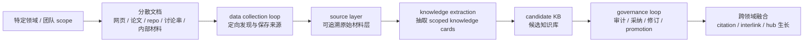
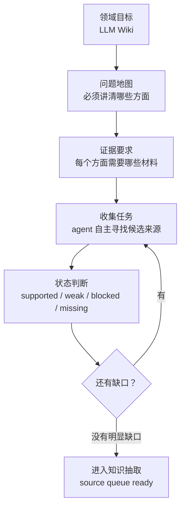
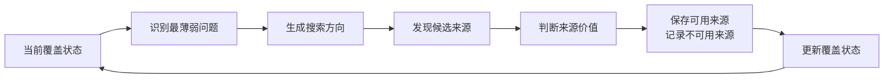
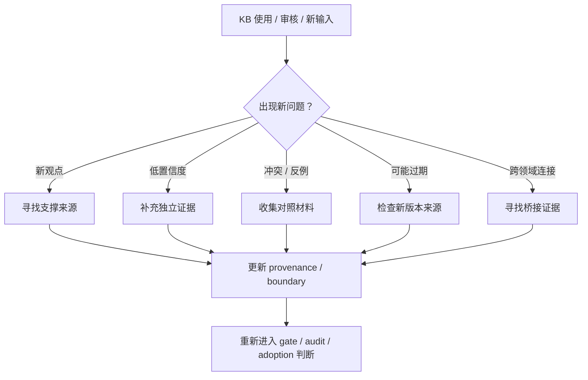
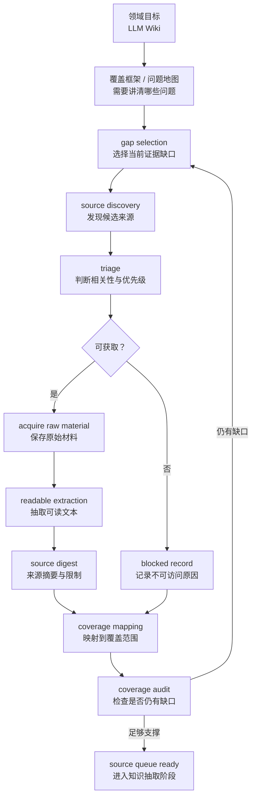

# 模块说明

本模块建议替换主报告中“## 4. 阶段演进”和“## 5. 当前阶段性进展”的主体内容；其中“实验背景与 data collection loop”也可前移，补充到“## 3. 背景与目标演进”之后。模块采用最新合并口径：v3 已完成首轮 adoption，当前状态为 `adoption_complete` / `candidate_ready`；root 级稳定产品尚未发布。

按照新的三段式报告结构，本模块主要对应第二部分 **case study**：用 LLM Wiki 这个具体实验说明整体构想、目标、设计、执行过程、结果和阶段性结论。第一部分 intro 应负责展示框架、问题意识和方法先进性；第三部分开放问题与 takeaways 应负责沉淀未解问题、后续判断和可迁移经验。本模块的重点是让读者看到这套框架如何真实跑起来，以及 data collection、v0/v1/v2/v3 各阶段如何共同构成一个可审计的知识生产案例。

## 实验背景与 data collection loop

本实验模拟一个更前置的真实工作场景：**特定领域内只有大量原始文档，知识藏在文档里，还没有被抽取成稳定知识块。** 项目的第一步是建立可用的来源材料层，再从这些材料中抽取、组织和审计知识。

这个设定接近企业内部知识管理的常见状态。现实中的知识通常天然分领域：一个部门、团队、项目或职能范围内会有自己的文档、权限边界和业务语境。领域划分来自人的心智模型和组织权限共同形成的管理边界。它的作用是先把知识边界收窄，降低收集、审核和使用成本。

同时，领域边界具备演化性。长期看，不同领域的知识库可以自然融合：先在一个清晰 scope 内完成收集、抽取和治理，再让跨领域引用、相邻主题和共享机制逐步生长。底层架构保持一致，同一套知识生产机制扩展到更多领域，也就是 scaling knowledge。

在这个大背景下，本次实验选择 `LLM Wiki` 作为目标主题。选择它的原因在于它具备合适的试验条件：有明确的源头材料，有社区讨论，有实现生态，也有与 RAG、PKM、agent memory、knowledge graph、文档系统等相邻领域的比较空间。这使它足以模拟一个“领域知识库从零构建”的过程。

### 为什么需要先做 data collection

data collection loop 的必要性来自两个判断。

第一，即使 scope 已经收窄到一个部门、团队或单一主题，相关文档仍然可能很多。人工一次性列全资料成本很高，也容易只覆盖最显眼的材料。定向收集的意义，是让系统围绕明确 coverage gap 去寻找材料，替代无边界搜索。

第二，在知识库建立之前，通常没有人真正知道“相关文档”在哪里。很多重要材料来自相邻讨论、工具实现、论文引用、社区反馈或批评性文章。让 agent 自主发现、保存和标注来源，是知识抽取之前合理的前置步骤。

因此，data collection 在本实验中有两层目的：

1. 面向未来落地：验证 agent 能否为一个组织内的集中领域知识库搭建原始材料层。
2. 面向未来应用：验证 agent 能否为开放领域或公共主题构建可持续扩展的资料入口。

还需要强调的是，data collection 具备动态性。它在项目启动时负责建立第一批来源材料；在 KB evolved 的过程中，也会持续承担“补证据”的职责。当新的观点、用户 input、反例、冲突判断或跨领域连接出现时，agent 需要回到资料收集环节，判断是否存在可信来源可以支撑、修正或反驳这些观点。

因此，data collection 同时服务两个阶段：

1. **前置 build KB。** 在知识块尚未形成时，先收集和保存领域材料，为后续知识抽取提供基础。
2. **后置 evolution support。** 在知识库迭代过程中，为新论点、新冲突、新边界和新版本变化补充可信来源。

这使 data collection 成为 knowledge governance 的一部分。一个观点能否进入 candidate KB，取决于观点合理性，也取决于系统能否找到足够可信、可追溯、可复查的材料来 justify 它。

### 覆盖框架具体是什么

这里的 `coverage framework` 可以理解为**领域覆盖框架**，更直白地说，是一张“这个领域要讲清楚，至少需要回答哪些问题”的问题地图。

如果没有这张问题地图，agent 的资料收集很容易变成普通搜索：看到什么抓什么，热门材料很多，边缘但关键的材料缺失。覆盖框架的作用，是把“找资料”变成一组可检查的目标。

在本实验里，覆盖框架大致回答三类问题：

1. **这个领域有哪些必要面向？** 例如 LLM Wiki 的来源与定义、问题动机、架构与数据模型、工作流、实现生态、评估证据、相邻方案比较、风险治理。
2. **每个面向需要什么证据？** 例如源头定义需要原始帖子、launch discussion 和早期社区讨论；实现生态需要 repo、插件、包页面和工具说明；风险治理需要安全、维护、来源可信度和审计相关材料。
3. **什么状态才算够用？** 够用标准包括来源是否可访问、是否保存了原始材料、是否抽取出可读文本、是否能支持后续 claim / card、是否还有明显缺口。

所以，覆盖框架体现的是“人工定义问题边界和验收标准，让 agent 在边界内自主发现资料”。人的角色是给出领域范围和判断标准；agent 的角色是在这个范围内寻找、筛选、保存和标注证据。

### agent 自主发现如何体现

agent 的自主性体现在资料清单由循环逐步扩展。人工只给定主题、初始线索和覆盖要求，agent 需要根据当前缺口决定下一步找什么。

例如，在 `origin_and_canon` 缺证据时，agent 会优先寻找 Karpathy 原始材料、X launch context、Hacker News 或其他早期讨论；在 `ecosystem_and_implementations` 缺证据时，会转向 GitHub repo、插件页、PyPI 包、社区实现；在 `comparison_space` 缺证据时，会寻找 RAG、PKM、agent memory、knowledge graph、文档系统等相邻方案材料；在 `risks_governance_ethics` 缺证据时，会补充安全、治理、维护、来源污染、过期知识和审计相关材料。

这个过程是循环判断：

这就是 data collection loop 中“自主发现”的核心：agent 在目标约束下主动补洞。它降低了对人工完整预知相关文档的依赖，也降低了开放搜索变成无边界资料堆积的风险。

### 动态补证据的触发场景

从长期运行看，data collection loop 至少会被五类事件重新触发：

1. **新观点出现。** 用户、agent 或外部材料提出新判断，但现有 KB 中没有足够证据支撑，需要补充来源来判断它是否成立。
2. **已有观点置信度不足。** 某张 card 已经可读，但 provenance 较弱、来源单一或证据类型偏窄，需要寻找更多独立材料来增强或限定结论。
3. **出现冲突或反例。** 新材料与已有 card 不一致时，data collection 需要帮助判断这是局部差异、版本变化、误解，还是需要修订原结论。
4. **知识过期或环境变化。** 工具、论文、社区实践、法律政策或组织流程发生变化时，需要重新收集更新来源，避免 KB stale。
5. **跨领域融合。** 当两个领域的 card 发生关联时，需要补充桥接材料，判断这种 interlink 是真实依赖、类比关系，还是过度联想。

这一点也解释了资料收集保留状态的必要性。长期知识库需要知道哪些观点已经有强证据，哪些只是暂时可用，哪些来源被阻塞，哪些判断需要未来补证据。只有这样，agent 才能在后续演化中把 data collection 用作持续校准机制。

### data collection loop 的设计逻辑

data collection loop 的核心是用覆盖框架约束发现过程。它从一个有限的领域目标出发，反复执行 gap-driven discovery：先判断当前知识库还缺什么类型的证据，再寻找候选来源，保存原始材料，抽取可读文本，形成来源摘要，并把来源映射回对应的领域问题。

这套 loop 背后的假设是：原始文档属于知识库的材料层，材料层可信度决定后续知识块的可审计性。后续 card、provenance、audit、interlink 都依赖这一层。如果来源没有被保存、状态没有被记录、限制没有被说明，后续生成的知识块即使语言完整，也很难被审计和维护。

从实现方式看，它让 agent 维护几个持续更新的状态面：候选来源有哪些、哪些已获取、哪些被阻塞、每个来源支持哪些问题、哪些问题仍然缺证据、哪些材料可以进入后续知识抽取。这样，agent 的每一轮行动都有明确依据：当前某个问题仍是 weak / missing，所以需要继续找对应证据。

### data collection 阶段结果

第一轮 data collection 为后续知识生产提供了 72 条 source 队列。后续 v3 production pass 基于这批来源形成 candidate KB，核心结果可压缩为下表：

| 指标 | 数值 | 表述建议 |
| --- | ---: | --- |
| sources | 72 | v3 覆盖 72 条 source 队列 |
| cards | 171 | 形成 171 张 candidate / accepted cards |
| governance | 342 或 513 | 171 份 provenance + 171 份 comparison provenance；如把 gate/audit decision 也算入治理记录，则为 513 |
| links | 974 | 建立 974 条 related / interlink 边 |

这组指标表达了从来源材料到候选知识网络的完整转化：source queue 提供材料输入，cards 承载知识单元，governance records 记录证据与采纳判断，links 形成可导航的知识关系。

## 阶段演变与最新 v3 进展

在 data collection 完成第一轮材料准备后，项目进入知识生产机制本身的验证。本项目的阶段演进围绕一个核心问题逐步收敛：如何把原始来源材料转化为可读、可追溯、可审计、可演化的候选知识库。v0 到 v3 的变化，体现了项目从机制验证、主题规划、小规模链路验证，进入到规模化候选生产与 adoption 的过程。

### v0：机制 demo 与 meta-topic 偏移

v0 阶段主要验证基础机制是否可运转，包括来源保存、引用记录、状态记录、影响队列和审计样本等。它的价值在于证明“知识生产流程可以被拆成可检查步骤”，降低对一次性写作的依赖。

但 v0 也暴露了方向偏移：产物更像是在讨论“如何生产知识库”的 meta knowledge，LLM Wiki 领域本身的知识沉淀不足。这意味着 v0 可以作为机制 demo 和审计样本保留，目标知识库继续扩展需要新的生产方式。它验证了流程的可行性，也提醒后续阶段必须避免把方法论本身误当成知识库主体。

### v1：top-down topic skeleton 的价值与局限

v1 阶段转向 top-down topic skeleton，试图先建立 LLM Wiki 的主题地图，覆盖 origin、definition、architecture、workflow、RAG comparison、risk、ecosystem、evaluation 等方向。

这一阶段的价值是提供了初步注意力地图：它帮助项目识别哪些主题区域值得覆盖，也让后续 card 生产有了可参考的概念边界。对早期探索而言，topic skeleton 能降低空白感，使团队快速形成对知识库范围的共同理解。

但 v1 的局限同样明显。过早把 topic 和 hub 作为生产单元，会让结构完整性压过证据可靠性，容易出现“主题看似覆盖完整，但每个主题背后的来源、边界和论证不足”的问题。因此，v1 更适合作为历史参考和未来 hub / topic map 的素材。项目由此形成一个关键判断：hub 和 topic 应该从经过审计的 card 中生长，来源驱动的知识生产应保持优先级。

### v2：scoped card 链路验证

v2 阶段开始转向 scoped knowledge card。相比 v1 的主题骨架，v2 更强调从具体来源材料中抽取知识候选，并把 card、provenance、comparison 和 audit 连接成一条可检查链路。

该阶段产出了 15 张 accepted cards，证明小规模 scoped card 生产是可行的：card 可以承载清晰边界，provenance 可以说明证据来源和适用范围，audit 可以把候选内容推进到 accepted 状态。v2 的核心贡献在于验证从来源到 accepted card 的治理链路成立。

同时，v2 也暴露了吞吐问题。逐张精修和逐张审核虽然稳健，但流程成本较高，难以直接支撑大规模来源队列。部分卡片也存在过度原子化或信息密度不足的风险，说明“可审计”需要同时保留可读性和生产效率。由此，v2 被定位为链路正确性的验证阶段。

### v3：draft-first、interlink、gate / audit 与 adoption

v3 在 v2 的基础上调整为 `draft-first` 流程。核心思路是先批量生成知识密度足够的 draft cards，再通过 comparison provenance、interlink、publication gate 和 fusion audit 进行分流、审查和采纳。

这一调整的意义在于把高成本判断后移：系统先形成可检查的 draft 网络，再判断哪些是 `new_card`，哪些是对既有 v2 card 的 `provenance_delta`，哪些需要合并、返修或跳过。这样既能提高吞吐，也能保留证据链和审计门禁。

v3 的另一个关键变化是把 interlink 纳入 adoption 的前置条件。候选知识库需要形成可导航、可检查的知识网络。related / interlink 边的建立，使 card 之间的上下文关系可以被复核，也为后续 hub、topic 和 citation graph 的生长提供基础。

最新口径下，v3 已经完成首轮 adoption，状态为 `adoption_complete` / `candidate_ready`。v3 已经形成 candidate-ready KB。这个结论仍然限定在候选知识库层面：它说明生产系统开始跑出规模；root stable product 尚未发布。

### 最新 v3 指标

截至当前合并口径，v3 已完成 72 条来源的一轮处理。其中 43 条来源成功生成 draft，22 条为空内容来源，7 条处于上游 blocked 状态。围绕这些来源，系统形成了 171 张 draft cards、171 份 draft provenance 和 171 份 comparison provenance。

| 指标 | 当前结果 |
| --- | ---: |
| sources | 72 |
| drafted sources | 43 |
| empty sources | 22 |
| upstream blocked sources | 7 |
| draft cards | 171 |
| draft provenance | 171 |
| comparison provenance | 171 |
| comparison 判定为 `new_card` | 163 |
| comparison 判定为 `provenance_delta` | 8 |
| publication gate pass | 163 |
| fusion audit pass | 8 |
| accepted cards | 171 |
| accepted provenance | 171 |
| related edges | 974 |
| orphan cards | 0 |
| dangling ids | 0 |
| v2-anchored cards | 8 |
| adoption status | `adoption_complete` |
| product status | `candidate_ready` |

这些数字说明，v3 已经从 v2 的小规模链路验证，进入到批量候选生产和首轮 adoption 阶段。171 张 accepted cards 与 171 份 accepted provenance 表明 card 与证据说明保持了一一对应；163 张 `new_card` 说明系统开始从来源材料中大规模扩展候选知识面；8 张 `provenance_delta` 和 8 张 v2-anchored cards 说明 v3 吸收了 v2 的有效沉淀。

974 条 related edges、0 orphan 和 0 dangling ids 进一步说明，v3 产物已经形成一个可导航的候选知识网络。这一点对于后续人工检查、topic 生长和 promotion decision 都很关键。

但这些指标的含义需要准确表述：它们代表生产系统已经开始跑出规模，且 candidate KB 已具备进一步评估和提升的基础；root stable product 尚未发布。下一阶段仍需要明确的人类 promotion decision，才能决定是否把 v3 candidate KB 提升为稳定知识库。
