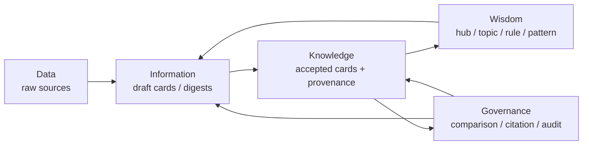

# Part 1. Intro / Framework

本文是一份分享和讨论材料，用一个实际 repo case 说明：当一个领域只有大量 raw sources，尚未形成成熟 knowledge base 时，如何让 agent loop 把文档持续编译成可读、可追溯、可修订、可生长的 LLM Wiki。

## 1.1 LLM Wiki 是一类什么问题

Karpathy 提出的 **LLM Wiki**，核心不是让 LLM 帮人写笔记，也不只是给 **RAG（Retrieval-Augmented Generation）** 增加一个更好的检索层。它提出的是一种新的知识工作范式：**让 LLM 在 raw sources 和用户 query 之间，持续维护一个可复利、可链接、可审计、可被人和 agent 共同消费的知识层。**

普通 RAG 模式通常在用户提问时检索相关片段，再生成一次性回答。这个模式解决了“回答时能不能找到材料”的问题，但没有解决“知识能不能沉淀、复用、更新和治理”的问题。同一个需要综合多份资料的问题，下次再问时仍然要重新检索、重新拼接、重新解释。

LLM Wiki 的基本心智模型更接近：

```text
raw sources
  -> LLM-maintained wiki
  -> query / exploration
  -> valuable answers write back to wiki
```

它的核心类比是：**Obsidian 是 IDE，LLM 是 programmer，wiki 是 codebase。** 这句话强调的是长期维护成本：新资料进入旧结构，旧说法被更新，冲突被记录，链接保持可导航，有价值的问答结果写回知识库。

因此，这里的“wiki”不是静态文档集合，而是持续演化的 **knowledge artifact**。它既能被人阅读，也能被 agent 检索、更新、链接和维护。更准确地说，LLM Wiki 的本体不是单纯的图数据库，也不是单纯的 Markdown 文件夹，而是一组有边界、有来源、有结构、有链接、有生命周期的 **knowledge cards / knowledge pages**，以及围绕这些卡片持续运行的维护工作流。

本文采用的工作定义是：

> **LLM Wiki 是一个由 LLM / agent 持续维护的知识卡片系统。每个知识卡片是人类可读、agent 可操作、来源可追溯的知识对象；卡片之间通过链接、引用、标签、实体关系、主题关系和时间关系形成轻量知识图；系统通过持续的提取、定界、去重、融合、链接、审核和提升，把原始文档逐步转化为可复用的知识库。**

这个定义强调三点。

第一，LLM Wiki 的基本单位不是原始文档，而是经过定界的知识单元。长文档适合保存原始语境，但不适合直接成为长期知识库的基本单位，因为它过长、过粗、难以局部更新，也难以被 agent 稳定复用。LLM Wiki 需要把文档中的知识拆解、重组和提升为更小、更清晰、更可操作的知识卡片。

第二，LLM Wiki 可以使用图结构，但它不等同于传统 **Knowledge Graph**。图是组织方式之一：card 是节点，链接、引用、主题归属、实体关系、相似关系、冲突关系和增量关系是边。但 LLM Wiki 的节点不是裸实体，而是带有解释、判断、证据、适用边界和维护状态的知识页面。

第三，LLM Wiki 的核心价值不只是“生成知识”，而是“治理知识”。它要处理哪些知识可信、哪些知识重复、哪些知识冲突、哪些知识只是候选、哪些知识可以提升为稳定层。换句话说，LLM Wiki 的核心不是 content generation，而是 **knowledge governance**。

## 1.2 LLM Wiki 的五个核心属性

为了把 LLM Wiki 和普通摘要库、RAG 索引、知识图谱、个人笔记系统区分开，本文将 LLM Wiki 理解为同时具备五个核心属性的知识系统：**source-grounded、schema-constrained、linkable / graphable、versionable / auditable、agent-operable**。

| 核心属性 | 含义 |
| --- | --- |
| **Source-grounded** | 每个知识卡片都应能追溯到原始资料，关键判断需要有来源、证据和适用上下文，避免知识库退化为不可验证的 LLM 生成文本。 |
| **Schema-constrained** | Card 不是随意文本，而应遵守稳定结构，例如标题、核心判断、摘要、来源、边界、相关链接、状态等字段，使人和 agent 都能稳定消费。 |
| **Linkable / graphable** | Card 之间需要通过引用、主题、实体、相似、冲突、增量等关系形成网络；图结构是组织和查询视图，但 card 本身仍是知识承载单元。 |
| **Versionable / auditable** | 知识不是一次生成后固定不变，而需要有 draft、candidate、stable、deprecated、blocked 等状态，并记录变更、审核和提升过程。 |
| **Agent-operable** | Agent 不只是读取 card，还要能创建、更新、拆分、合并、补充来源、建立链接、标记冲突、执行检查，并把有价值回答写回知识库。 |

这五个属性共同定义了 LLM Wiki 的边界：它不是简单的文档摘要，也不是单纯的向量索引，而是一个可被 agent 长期维护、可被人持续消费、可被系统审计和演化的知识工作空间。

## 1.3 从文档库到知识库：agent 执行的知识编译操作

在这个框架下，真正需要解决的问题不是：

```text
如何让 LLM 总结一批文档？
```

而是：

```text
如何让 agent 从文档库中持续生产
可追溯、可链接、可审核、可演化、
可被人和 agent 共同消费的知识单元？
```

这里可以把 agent 的工作理解为一组 **knowledge compilation operations**。所谓“编译”，不是指 repo 里必须有一个独立 compilation layer，而是指 agent 对 raw sources 执行的一系列知识加工动作：

```text
extraction
scoping
deduplication
synthesis / fusion
interlinking
comparison
conflict marking
provenance binding
state assignment
audit preparation
```

这些操作的目标，是把长文档、网页、论文、讨论串和实现资料，转化为更适合长期维护的知识卡片。原始文档保存事实来源；agent 负责从中抽取和组织知识；知识卡片承载可读、可查、可链接、可审核的中间成果；人负责消费、检查和做关键提升决策。

因此，这里的核心不是“增加一个 compilation layer”，而是明确：**从 doc base 到 knowledge base 的转化过程，需要由 agent 持续执行一组知识编译操作。**

## 1.4 用 DIKW 看 LLM Wiki 的层级

DIKW 可以作为本实验的建模语言：Data 是原料，Information 是候选理解，Knowledge 是经过治理后被接受的知识，Wisdom 是从知识网络中生长出的判断、模式和行动规则。

| DIKW 层级 | 在本实验中的对应物 | 当前状态 | Agent 的主要动作 | 人的主要动作 |
| --- | --- | --- | --- | --- |
| **Data** | raw papers、blogs、repos、discussions、网页、帖子、原始文件 | 原始材料层 | discovery、saving、readable extraction、status tracking | 定义领域范围、优先级和初始问题 |
| **Information** | source digest、fact candidates、draft cards、draft provenance | 候选信息层，尚未完成接受 | extraction、scoping、drafting、初步证据绑定 | 检查方向、指出遗漏或偏差 |
| **Knowledge** | accepted cards、accepted provenance、comparison provenance、citation links | 已进入 candidate KB 的知识层 | audit、comparison、deduplication、fusion、interlink、adoption | 轻量审核、消费、判断是否 promotion |
| **Wisdom** | 从 card 网络中生长出的 hub、topic、pattern、rule、SOP、判断框架 | 可复用的结构性理解 | pattern discovery、rule evolution、跨卡片综合、基于使用历史更新 | 使用、反馈、做关键取舍和阶段性承诺 |

这个表定义了整个流程的方向：**raw source 不直接等于 knowledge；summary 也不自动等于可信 knowledge。Draft card 仍在 Information 层，accepted card 才进入 Knowledge 层；Wisdom 来自 accepted knowledge 的长期连接、复用、冲突和修订。**

用 DIKW 看，LLM Wiki 的关键动作不是把 Data 直接变成答案，而是把 Data 逐步编译成可治理的 Information，再通过 provenance、comparison、interlink、gate / audit 和 promotion，让一部分 Information 进入 Knowledge，并最终从 Knowledge 网络中生长出 Wisdom。

## 1.5 LLM Wiki 与 RAG、GraphRAG、Graphify、知识图谱的边界

从系统位置上看，LLM Wiki 处在 RAG、GraphRAG、知识图谱和文档库之间，但不等同于其中任何一个。

这里的 **GraphRAG** 主要指以 Microsoft GraphRAG 为代表的 graph-based RAG 路线；**Graphify / graphification** 则既可以指 Graphify 这类把 repo、文档、论文和图像材料转成可查询 knowledge graph 的工具，也可以泛指“把材料图化”的操作。

| 系统 / 方法 | 主要对象 | 核心动作 | 强项 | 相对 LLM Wiki 的边界 |
| --- | --- | --- | --- | --- |
| **Doc base** | 原始文件、网页、论文、repo、讨论串 | 保存、归档、检索 | 保留原始语境和证据 | raw source 还不是 knowledge；它缺少定界、链接、状态和治理。 |
| **RAG** | chunk、embedding、retrieval context | query-time retrieval + answer generation | 回答具体问题时找到相关材料 | 通常不沉淀可复用知识层；同类问题容易反复检索、反复拼接。 |
| **GraphRAG** | entity graph、community reports、graph-based query context | 从语料抽实体关系，生成社群摘要，再用 local / global / DRIFT search 回答问题 | 适合全局 sensemaking，例如“整个语料的主要主题是什么” | 它更像 graph index + query engine；核心产物是服务回答的图索引和 community summaries，不必然形成可读、可审核、可提升状态的 wiki card。 |
| **Graphify / graphification** | code / docs / papers / diagrams 生成的 corpus graph | 静态分析、LLM 语义抽取、图构建、聚类、可视化和报告 | 适合让 coding assistant 快速理解 repo 结构、跨文件关系和意外连接 | 它更像把项目材料 graphify 的工具或操作；强在图化、压缩和导航，不等同于完整的知识生命周期治理。 |
| **Knowledge Graph** | entity / relation / schema | 结构化建模和关系查询 | 适合精确关系表达、多跳查询、图算法 | 节点通常是实体或关系事实，不天然承担人类可读的解释、论证、边界和版本状态。 |
| **LLM Wiki** | knowledge card / page + provenance + lifecycle | 把资料编译成可读、可链接、可审计、可修订、可提升的知识层 | 适合长期维护、团队共识、知识复利和 agent write-back | 它可以使用 RAG、GraphRAG、Graphify 或 KG，但目标是更高层的 knowledge governance。 |

这个对比的重点不是说 LLM Wiki 要替代这些系统。更好的理解是：RAG 可以作为检索工具，GraphRAG 可以作为全局语料 sensemaking 的图索引路线，Graphify 可以作为 repo / corpus graphification 的工具，Knowledge Graph 可以作为关系结构和图算法底座。LLM Wiki 的问题意识在它们之上：**这些被检索、被图化、被摘要、被聚类出来的内容，如何变成人和 agent 可以长期共同维护的知识对象？**

因此，LLM Wiki 的先进性不在于“用了图”，而在于它把图、检索、文档和写回纳入一个持续运转的知识治理框架中。

## 1.6 Facts 的类型：known_fact 与 accepted_fact

早期 loop 中曾把 atomic card 默认视为 facts，因此要求强校验。这里有两类 fact type，需要和 card status 分开理解。

| 概念 | 含义 | 典型例子 | 可靠性来源 |
| --- | --- | --- | --- |
| `known_fact` | 相对稳定的事实，或某个来源明确陈述且 scope 清楚的事实 | 牛顿第一定律；某篇 gist 明确把 LLM Wiki 架构分成 raw sources / wiki / schema | 外部事实稳定性，或来源文本的直接支撑 |
| `accepted_fact` | 当前语境、团队、流程或 KB 中被采纳为有效依据的事实 | 当前团队采用的 SOP；当前实验采纳的 production 流程；某个阶段被确认的治理规则 | 本系统的审核、采纳、共识和版本承诺 |

`known_fact` / `accepted_fact` 是事实类型。`draft` / `accepted` 是 card 状态。一张 `known_fact` card 可以处于 `draft` 状态，也可以通过 gate / audit 后进入 `accepted` 状态。状态变化代表卡片被采纳，事实类型本身仍由事实来源和适用范围决定。

这个区分的意义在于，系统可以同时处理两类知识：一类来自外部世界或来源文本，另一类来自当前组织和当前版本的治理共识。前者回答“这个说法是否被来源或稳定事实支撑”，后者回答“这个说法是否已经被本系统在当前版本中采纳为可用依据”。

## 1.7 核心设计原则

**Card 是可读知识单元，不是机械 claim 切片。** Card 首先要能被人和 agent 阅读、引用、维护。它应该是 scoped knowledge unit，而不是把知识切到最小 claim 后得到的碎片。Claim 可以存在，但 claim 是 card 内部可被审计的主张，不是知识库的唯一主体。过度 claim-level 化会损害阅读体验，也会带来接近 knowledge graph 的维护成本。

**Governance layer 围绕 card 展开。** Provenance、boundary、conflict、comparison 和 gate / audit 是治理层，不是正文的替代品。它们共同回答：这张 card 基于哪些来源，判断边界在哪里，它和已有知识是什么关系，是否存在重复、冲突或补充，为什么它可以进入候选知识库，未来修订应该从哪里开始。

**Candidate 和 stable 必须分开。** Candidate KB 是可使用、可审核、可提升的候选层。Stable product 需要额外的 promotion decision，代表人对某个阶段性版本作出发布承诺。这个区分让系统可以持续生产和吸收新知识，同时不把所有新产物都伪装成最终版本。

**Citation / related 应该从真实引用关系里生长。** `references` 表示 card-level broad dependency；`footnotes` 表示 inline citation；card 本身也应成为 cite-able object。`related` 更适合作为从 footnotes、card citation 和 citation graph 中派生的 metadata，用于导航、聚类、Obsidian 展示和后续分析。

**Hub 和 topic 应从 card 网络中生长。** Top-down topic map 可以提供注意力地图和 coverage 检查，但不适合作为主要生产起点。更稳的方式是先从来源材料生产 scoped cards，再让 hub、topic、cluster 和导航结构从 card 网络中逐步浮现。

## 1.8 当前阶段的位置

当前实验已经从资料获取和主题规划，推进到批量候选知识卡生产。v3 已形成 `candidate_ready` 状态的 candidate KB。它具备继续检查和 promotion 的基础，root 级 stable product 仍需要人工决策。



后面的 Part 2 会把这套框架放回具体实践：这个 repo 如何从 source discovery、source digest、draft-first production、provenance、comparison、interlink、gate / audit，一步步推进到一个 `candidate_ready` 的 LLM Wiki candidate KB。
