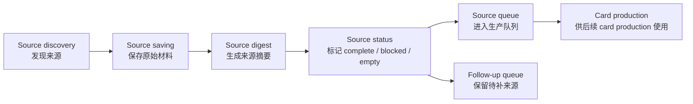
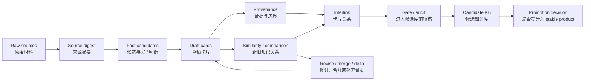

# Part 2. Case Study / 我的实践

## 2.1 构想与目的

这个实践选择 `LLM Wiki` 作为目标领域，原因是它有明确源头材料、社区讨论、实现生态，也能自然连接 RAG、PKM、agent memory、knowledge graph、文档系统和治理问题。

它不是为了马上交付一个 finished wiki product，而是验证一个更前置的问题：当一个领域还只有 raw sources，还没有成熟 knowledge base 时，agent loop 能不能持续把材料生产成可读、可追溯、可修订、可继续生长的知识库。

项目目标可以压缩为一句话：

> **用 agent loop 验证一条从 source 到 card、从 card 到 candidate KB、再从 candidate KB 到 stable product 的知识生产路径。**

人的角色是检查、审核、反馈和 promotion decision。Agent 的角色是发现材料、抽取信息、生成 card、补 provenance、比较新旧知识、建立 interlink，并持续维护候选知识库。

## 2.2 Zen：实践中的基本态度

这个 case 里最早被验证的不是某个工程技巧，而是对知识生产本身的态度。如果系统假装一开始就能切出完美主题、完美颗粒度和完美事实，它很快会被真实材料拖垮。

**第一，忍受边界的模糊。** LLM Wiki 这个主题可以按概念、架构、workflow、工具、风险、评估、社区讨论等很多方式拆分。实践中没有一次性正确的 taxonomy，因此 v3 选择先从来源材料生长 scoped cards，再让 hub、topic 和 cluster 从 card 网络里浮现。

**第二，容许错误和过期。** 一些来源会不可读，一些来源会暂时 blocked，一些 card 也可能在后续 comparison 中被发现只是 provenance delta，而不是全新的知识。系统不能要求所有中间结果都正确，但必须要求每个判断都能被追溯、比较和修订。

**第三，追求可治理，而不是追求一次性正确。** v3 的关键产物不只是 171 张 card，而是 card 连同 provenance、comparison provenance、interlink 和 gate / audit 记录一起进入 candidate KB。也就是说，知识不是被一次写完，而是在治理流程里逐步获得状态。

## 2.3 Design Rules：把构想变成生产约束

这轮实践逐渐收敛出几条 design rules。它们不是抽象原则，而是 agent loop 真正执行时用来避免跑偏的约束。

1. **Source first，topic later。** Topic map 可以帮助 coverage 检查，但不应该替代知识生产。真正的知识单元要从 papers、webpages、threads、repos 等来源中抽取出来。
2. **Card 是可读知识单元。** Card 不应该只是最小 claim 的机械切片。它需要有清楚标题、明确边界、可读正文，并能被人和 agent 继续引用、修订和维护。
3. **Governance layer 必须跟着 card 走。** Provenance 说明来源和边界，comparison 判断新旧知识关系，gate / audit 决定是否进入 candidate KB。没有治理层的 card 只是草稿内容。
4. **Interlink 是 adoption 前置条件。** 知识库不能是一组孤立卡片。Card 之间的 related / interlink 让 candidate KB 可以被导航、检查和继续扩展。
5. **Candidate 和 stable 分开。** Candidate-ready 代表候选知识网络已经可检查、可使用、可继续提升；stable product 需要额外的人工 promotion decision。

## 2.4 Data Collection：先建立材料层

本实验模拟一个常见组织场景：特定领域内有大量文档，知识藏在文档里，尚未形成稳定知识块。领域边界可以来自团队、部门、项目、职能范围，也可以来自一个开放主题。先在单一 scope 内完成材料收集、知识抽取和治理，再让跨领域引用、相邻主题和共享机制逐步生长。

Data collection 在这里承担两类职责：

1. **前置 build KB。** 在知识块形成前，agent 收集和保存领域材料，为后续知识抽取提供可追溯输入。
2. **后置 evolution support。** 在 KB 演化过程中，新观点、冲突、版本变化和跨领域连接会触发补证据，agent 回到材料层寻找支撑或反例。

材料层的基本流程是：

```text
source discovery
-> source saving
-> source digest
-> source status
-> source queue
```



本轮资料层留下了可复核的执行痕迹：47 条 loop events、3 个 gap-driven search tasks、27 条 discovery candidate sources、72 条 source digest records。来源类型分布和示例来源如下：

| 来源类型 | 数量 | 示例来源 |
| --- | ---: | --- |
| webpage | 25 | `karpathy-x-launch-post`、`owasp-llm-top10-2025`、`wikibase-data-model` |
| github_repo | 20 | `repo-atomicstrata-llm-wiki-compiler`、`repo-microsoft-graphrag` |
| arxiv | 17 | `arxiv-mem0`、`arxiv-graphrag` |
| reddit | 6 | `reddit-claudecode-plugin`、`reddit-openkb-long-pdf` |
| pypi | 2 | `pypi-my-llm-wiki`、`pypi-llm-wiki-mcp` |
| gist_raw | 1 | `karpathy-gist-llm-wiki` |
| hacker_news | 1 | `hacker-news-original-thread` |
| **合计** | **72** | - |

来源状态为：65 条 `complete`，7 条 `pending_or_blocked`。这些状态本身也很重要：empty source、不可读来源、upstream blocked source 不能默默消失，因为它们决定后续增量生产和补证据时从哪里继续。

文件结构及介绍：

```text
data/
  discovery/              # search tasks、candidate sources、triage decisions
  logs/                   # loop events、acquisition failures、source access logs
  manifests/              # source index、coverage records、source digests
  raw/                    # 保存后的原始材料
    arxiv/                # paper bundles
    github_repo/          # repo docs and implementation material
    webpage/              # web pages and guides
    reddit/               # discussion threads
    pypi/                 # package pages
    gist_raw/             # Karpathy gist source
    hacker_news/          # HN discussion

v3 candidate capsule/
  outputs/llm_wiki/drafts/
    cards/                # draft cards，Information 层
    provenance/           # draft provenance
    comparison/           # draft 与既有知识的关系判断
    similarity/           # 轻量相似召回结果
  outputs/llm_wiki/kb/
    cards/                # accepted cards，Knowledge 层
    provenance/           # accepted provenance
    indexes/              # candidate KB 索引
    references/           # 引用和关系材料
```

## 2.5 KB Construction：从来源到候选知识库

知识库构建链路如下：

```text
raw sources
-> source digest
-> fact candidates
-> draft cards
-> provenance
-> similarity / comparison
-> interlink
-> gate / audit
-> candidate KB
-> promotion decision
```



这条链路的关键是把“写内容”拆成几个不同状态。Raw source 只是材料，source digest 帮助判断来源内容、覆盖范围和可用性。Draft card 是 Information 层的候选理解，provenance 让它带上证据和边界，similarity / comparison 判断它和已有知识是重复、补充、冲突还是新增。只有通过 gate / audit 后，它才进入 candidate KB。

这条链路也和 DIKW 对应：

- raw sources 属于 Data；
- digest、fact candidates、draft cards 属于 Information；
- accepted cards、accepted provenance、comparison provenance、citation links 属于 Knowledge；
- hub、topic、pattern、rule 和后续 SOP 属于 Wisdom。

因此，KB construction 不是一次性写完一批页面，而是从 source 到 card、从 card 到 graph、从 candidate 到 stable 的持续生长过程。

## 2.6 Results：本轮得到了什么

按照最新简化口径，v3 本轮结果可以压缩为四类指标：

| 类别 | 数值 | 含义 |
| --- | ---: | --- |
| **Sources** | 72 | 覆盖 72 条 source 队列 |
| **Cards** | 171 | 形成 171 张 candidate / accepted cards |
| **Governance** | 342 | 171 份 provenance + 171 份 comparison provenance |
| **Links** | 974 | 建立 974 条 related / interlink 边 |

当前状态为 `adoption_complete` / `candidate_ready`。这说明 v3 已经形成一个可检查、可导航、可继续提升的 candidate KB。Root 级 stable product 尚未发布。

## 2.7 Iteration：判断如何演化出来

这个 case 的路径不是一开始就确定的。v0 到 v3 的变化，本质上是对“什么才算知识生产”的连续纠偏。

| 阶段 | Idea | Flow | Result | Problem | Experience |
| --- | --- | --- | --- | --- | --- |
| v0 | 验证基本机制 | 来源保存、状态记录、小规模推进 | 机制可运行 | 内容偏向 meta knowledge | 机制验证是基础，目标知识需要单独生产 |
| v1 | 建立 top-down topic map | 从 origin、definition、architecture、workflow、risk、ecosystem 规划主题 | 形成早期注意力地图 | 结构完整性压过证据可靠性 | topic 适合导航和 coverage 检查，不适合作为主要生产起点 |
| v2 | 转向 scoped knowledge card | 从来源生成 card，补 provenance，通过 audit 采纳 | 15 张 accepted cards，链路成立 | 吞吐低，部分卡片过度原子化 | card 应服务阅读，provenance 是可信度的一部分 |
| v3 | draft-first，再治理吸收 | 批量 draft，补 provenance、comparison、interlink，再 gate / audit | 171 cards 的 candidate-ready KB | similarity miss、blocked sources、citation 规则仍需校准 | 规模化关键在比较、吸收、修订和提升 |

v3 还校准了四个操作原则：production pass 要覆盖完整来源队列；长来源优先全文读取；中文是默认交付语言；interlink 是 adoption 前置条件。

## 2.8 Case Study 小结

这个 case 已经证明：从 raw sources 到 candidate KB 的链路可以跑通。v3 的价值不只是多生成了 card，而是形成了一个由 card、provenance、comparison 和 interlink 共同支撑的候选知识网络。

当前结果仍处于 candidate-ready 状态。它代表 Part 1 中的框架已经落到一次可观察的实践里，但 stable promotion 仍需要人工决策。
